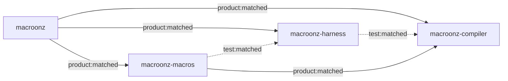

# Macroonz evidence navigation graph

- Model grammar: `macroonz-evidence-model/1`
- Model identity: `f6da4dbd81f37c7720015bbcb8c338cbcdc9a19e`

This graph routes from live source owners to their section references and public doors without restating their semantic claims.

## Evidence graph

```mermaid
flowchart LR
  s0[".durafx/package/wave-g-release-0.1.0-20260828/receipt.md"]
  s1[".durafx/qualification/0.2-h-api-compatibility-20260831/receipt.md"]
  s2[".durafx/qualification/0.2-j-facade-posture-economics-20260831/receipt.md"]
  s3[".durafx/qualification/0.2-j-guarded-economics-20260831/receipt.md"]
  s4[".durafx/qualification/0.2-j-shape-projection-economics-20260831/receipt.md"]
  s5[".durafx/qualification/0.2-k-cohesive-subject-20260831/receipt.md"]
  s6[".durafx/qualification/0.2-k-concurrency-runtime-20260831/receipt.md"]
  s7[".durafx/qualification/0.2-k-docs-blind-storefront-20260831/receipt.md"]
  s8[".durafx/qualification/0.2-k-guarded-package-journey-20260831/receipt.md"]
  s9[".durafx/qualification/0.2-k-parser-codec-20260831/receipt.md"]
  s10[".durafx/qualification/0.2-m-factoring-ruling-20260831/receipt.md"]
  s11[".durafx/qualification/wave-f-solo-governance-20260828/receipt.md"]
  s12["AGENTS.md"]
  s13["Cargo.toml"]
  s14["harness/Cargo.toml"]
  s15["macros/compiler/Cargo.toml"]
  s16["macros/proc/Cargo.toml"]
  s17["src/lib.rs"]
  s18["harness/src/lib.rs"]
  s19["macros/compiler/src/lib.rs"]
  s20["macros/proc/src/lib.rs"]
  n0["3:Standing architecture,claim,evidence,foundation"]
  s0 --> n0
  n1["14:Hosted source crossing architecture,ceiling,claim,evidence,foundation,sensitivity"]
  s0 --> n1
  n2["27:Dependency-ordered publication architecture,ceiling,claim,cost,evidence,foundation"]
  s0 --> n2
  n3["49:Registry-delivered adopter architecture,claim,evidence,foundation"]
  s0 --> n3
  n4["57:Documentation delivery evidence,foundation"]
  s0 --> n4
  n5["65:Cleanup status architecture,claim,cost,evidence,foundation"]
  s0 --> n5
  n6["75:Plane limits architecture,ceiling,evidence,foundation"]
  s0 --> n6
  n7["5:Authority architecture,assumption,claim,evidence,foundation"]
  s1 --> n7
  n8["18:Exact package denominator architecture,assumption,ceiling,claim,cost,evidence,foundation,sensitivity"]
  s1 --> n8
  n9["36:Symmetric analyzer topology architecture,assumption,ceiling,evidence,foundation"]
  s1 --> n9
  n10["44:Analyzer matrix architecture,assumption,ceiling,evidence,foundation"]
  s1 --> n10
  n11["65:Public-path and package-source census architecture,assumption,ceiling,evidence,foundation"]
  s1 --> n11
  n12["77:Package-shaped generated and facade crossings architecture,assumption,ceiling,evidence,foundation"]
  s1 --> n12
  n13["87:Planted controls architecture,assumption,ceiling,evidence,foundation,sensitivity"]
  s1 --> n13
  n14["110:Analyzer and dependency-policy ceilings architecture,assumption,ceiling,claim,evidence,foundation,sensitivity"]
  s1 --> n14
  n15["119:Parent QA and resource disposition architecture,assumption,ceiling,cost,evidence,foundation"]
  s1 --> n15
  n16["130:Compact custody architecture,evidence,foundation,sensitivity"]
  s1 --> n16
  n17["138:Acceptance and remaining ceilings architecture,assumption,ceiling,claim,evidence,foundation,sensitivity"]
  s1 --> n17
  n18["5:Authority architecture,cost,evidence,foundation"]
  s2 --> n18
  n19["18:Typed work and controls architecture,ceiling,claim,cost,evidence,foundation"]
  s2 --> n19
  n20["36:Local host observations ceiling,cost,evidence,foundation"]
  s2 --> n20
  n21["54:Qualification and custody architecture,claim,evidence,foundation"]
  s2 --> n21
  n22["64:Ceiling architecture,ceiling,claim,cost,evidence,foundation,sensitivity"]
  s2 --> n22
  n23["5:Authority architecture,claim,cost,evidence,foundation"]
  s3 --> n23
  n24["16:Input custody architecture,assumption,claim,cost,evidence,foundation"]
  s3 --> n24
  n25["25:Correctness and typed work assumption,ceiling,claim,cost,evidence,foundation,sensitivity"]
  s3 --> n25
  n26["37:Measured local observations cost,evidence,foundation"]
  s3 --> n26
  n27["47:Stable source coverage claim,cost,evidence,foundation"]
  s3 --> n27
  n28["55:Current-source sensitivity join assumption,claim,cost,evidence,foundation,sensitivity"]
  s3 --> n28
  n29["62:Corrections and exclusions assumption,ceiling,claim,cost,evidence,foundation"]
  s3 --> n29
  n30["72:Compact custody architecture,claim,cost,evidence,foundation,sensitivity"]
  s3 --> n30
  n31["81:Standing and next boundary architecture,assumption,ceiling,claim,cost,evidence,foundation,sensitivity"]
  s3 --> n31
  n32["5:Authority architecture,claim,cost,evidence,foundation"]
  s4 --> n32
  n33["15:Input custody architecture,claim,cost,evidence,foundation"]
  s4 --> n33
  n34["25:Correctness and typed work architecture,ceiling,claim,cost,evidence,foundation,sensitivity"]
  s4 --> n34
  n35["34:Shape-member work curve cost,evidence,foundation,sensitivity"]
  s4 --> n35
  n36["45:Projection-accounting work curve cost,evidence,foundation,sensitivity"]
  s4 --> n36
  n37["54:Repeatability and sensitivity posture architecture,assumption,claim,cost,evidence,foundation,sensitivity"]
  s4 --> n37
  n38["66:Reconstruction and cleanup ceiling,cost,evidence,foundation"]
  s4 --> n38
  n39["76:Compact custody architecture,evidence,foundation,sensitivity"]
  s4 --> n39
  n40["84:Standing and next boundary architecture,assumption,ceiling,claim,cost,evidence,foundation,sensitivity"]
  s4 --> n40
  n41["3:Accepted observation architecture,ceiling,claim,evidence,foundation"]
  s5 --> n41
  n42["9:Authority architecture,claim,evidence,foundation,sensitivity"]
  s5 --> n42
  n43["20:Package and source custody architecture,assumption,claim,cost,evidence,foundation,sensitivity"]
  s5 --> n43
  n44["38:Cohesive behavior architecture,assumption,ceiling,claim,evidence,foundation,sensitivity"]
  s5 --> n44
  n45["61:Stable coverage feedback ceiling,claim,cost,evidence,foundation"]
  s5 --> n45
  n46["74:Subject-code mutation architecture,assumption,ceiling,claim,evidence,foundation,sensitivity"]
  s5 --> n46
  n47["88:Economics join architecture,assumption,claim,cost,evidence,foundation,sensitivity"]
  s5 --> n47
  n48["96:Final local wall architecture,evidence,foundation,sensitivity"]
  s5 --> n48
  n49["105:Evidence ceilings architecture,assumption,ceiling,claim,cost,evidence,foundation"]
  s5 --> n49
  n50["112:Cleanup boundary architecture,ceiling,claim,cost,evidence,foundation,sensitivity"]
  s5 --> n50
  n51["3:Accepted observation architecture,ceiling,claim,evidence,foundation"]
  s6 --> n51
  n52["10:Package custody architecture,assumption,claim,cost,evidence,foundation"]
  s6 --> n52
  n53["20:Subject-owned schedule claim claim,evidence,sensitivity"]
  s6 --> n53
  n54["30:Reduction and replay architecture,ceiling,claim,evidence,foundation,sensitivity"]
  s6 --> n54
  n55["39:Runner and process-host standing assumption,ceiling,claim,cost,evidence,foundation"]
  s6 --> n55
  n56["47:Source custody architecture,assumption,ceiling,claim,cost,evidence,foundation"]
  s6 --> n56
  n57["65:Qualification and ceilings architecture,ceiling,claim,cost,evidence,foundation"]
  s6 --> n57
  n58["3:Accepted observation architecture,ceiling,claim,evidence,foundation"]
  s7 --> n58
  n59["11:Public source boundary architecture,claim,evidence,foundation"]
  s7 --> n59
  n60["25:Completed journeys architecture,claim,evidence,foundation,sensitivity"]
  s7 --> n60
  n61["34:Qualification and friction architecture,assumption,ceiling,claim,evidence,foundation"]
  s7 --> n61
  n62["44:Host, custody, and ceilings architecture,ceiling,claim,cost,evidence,foundation"]
  s7 --> n62
  n63["3:Accepted observation architecture,ceiling,claim,evidence,foundation,sensitivity"]
  s8 --> n63
  n64["11:Package custody architecture,assumption,cost,evidence,foundation"]
  s8 --> n64
  n65["29:Subject authority and current crossings architecture,assumption,claim,cost,evidence,foundation,sensitivity"]
  s8 --> n65
  n66["53:Mutation evidence boundary architecture,assumption,ceiling,claim,evidence,foundation,sensitivity"]
  s8 --> n66
  n67["61:Host and feature ceilings architecture,ceiling,claim,cost,evidence,foundation"]
  s8 --> n67
  n68["70:Custody and cleanup architecture,assumption,ceiling,claim,cost,evidence,foundation"]
  s8 --> n68
  n69["3:Accepted observation architecture,ceiling,claim,evidence,foundation,sensitivity"]
  s9 --> n69
  n70["13:Package custody architecture,ceiling,cost,evidence,foundation"]
  s9 --> n70
  n71["26:Subject grammar and codec assumption,ceiling,claim,evidence,sensitivity"]
  s9 --> n71
  n72["36:Coverage, feedback, reduction, and replay assumption,ceiling,claim,cost,evidence,foundation,sensitivity"]
  s9 --> n72
  n73["50:Mutation sensitivity assumption,ceiling,evidence,foundation,sensitivity"]
  s9 --> n73
  n74["67:Source custody architecture,assumption,ceiling,claim,cost,evidence,foundation,sensitivity"]
  s9 --> n74
  n75["95:Qualification and ceilings architecture,ceiling,claim,cost,evidence,foundation,sensitivity"]
  s9 --> n75
  n76["3:Standing ceiling,claim,evidence"]
  s10 --> n76
  n77["9:Already-earned compiler structure architecture,assumption,ceiling,claim,evidence,foundation"]
  s10 --> n77
  n78["17:Existing harness composition architecture,assumption,claim,cost,evidence,foundation,sensitivity"]
  s10 --> n78
  n79["26:Repeated glue disposition architecture,assumption,ceiling,claim,evidence,foundation,sensitivity"]
  s10 --> n79
  n80["37:Documentation and stamps architecture,claim,evidence,foundation,sensitivity"]
  s10 --> n80
  n81["44:Derived evidence model architecture,assumption,claim,evidence,foundation"]
  s10 --> n81
  n82["50:Rejected candidates architecture,assumption,claim,evidence,foundation"]
  s10 --> n82
  n83["61:Acceptance and ceiling architecture,assumption,ceiling,claim,evidence,foundation"]
  s10 --> n83
  n84["3:Standing architecture,claim,evidence,foundation,sensitivity"]
  s11 --> n84
  n85["13:Prior state evidence,foundation"]
  s11 --> n85
  n86["21:Applied state evidence"]
  s11 --> n86
  n87["33:Repository compatibility architecture,claim,evidence,foundation"]
  s11 --> n87
  n88["42:Verification assumption,claim,evidence"]
  s11 --> n88
  n89["50:Plane limits architecture,ceiling,claim,evidence,foundation"]
  s11 --> n89
```

## Package graph

## Capability navigation

- `macroonz` -> `compiler` -> `src/lib.rs:7`
- `macroonz-compiler` -> `bounded` -> `macros/compiler/src/lib.rs:10`
- `macroonz-compiler` -> `closure` -> `macros/compiler/src/lib.rs:18`
- `macroonz-compiler` -> `codec` -> `macros/compiler/src/lib.rs:23`
- `macroonz-compiler` -> `descriptor` -> `macros/compiler/src/lib.rs:22`
- `macroonz-compiler` -> `diagnostic` -> `macros/compiler/src/lib.rs:15`
- `macroonz-compiler` -> `expansion` -> `macros/compiler/src/lib.rs:20`
- `macroonz-compiler` -> `explanation` -> `macros/compiler/src/lib.rs:19`
- `macroonz-compiler` -> `host` -> `macros/compiler/src/lib.rs:28`
- `macroonz-compiler` -> `identity` -> `macros/compiler/src/lib.rs:11`
- `macroonz-compiler` -> `kind` -> `macros/compiler/src/lib.rs:13`
- `macroonz-compiler` -> `origin` -> `macros/compiler/src/lib.rs:14`
- `macroonz-compiler` -> `plan` -> `macros/compiler/src/lib.rs:16`
- `macroonz-compiler` -> `render` -> `macros/compiler/src/lib.rs:17`
- `macroonz-compiler` -> `request` -> `macros/compiler/src/lib.rs:25`
- `macroonz-compiler` -> `stamp` -> `macros/compiler/src/lib.rs:24`
- `macroonz-compiler` -> `support` -> `macros/compiler/src/lib.rs:21`
- `macroonz-compiler` -> `token` -> `macros/compiler/src/lib.rs:12`
- `macroonz` -> `harness` -> `src/lib.rs:14`
- `macroonz-harness` -> `bench` -> `harness/src/lib.rs:22`
- `macroonz-harness` -> `clock` -> `harness/src/lib.rs:23`
- `macroonz-harness` -> `corpus` -> `harness/src/lib.rs:24`
- `macroonz-harness` -> `depot` -> `harness/src/lib.rs:25`
- `macroonz-harness` -> `descriptor` -> `harness/src/lib.rs:26`
- `macroonz-harness` -> `fault` -> `harness/src/lib.rs:27`
- `macroonz-harness` -> `fuzz` -> `harness/src/lib.rs:28`
- `macroonz-harness` -> `generate` -> `harness/src/lib.rs:29`
- `macroonz-harness` -> `identity` -> `harness/src/lib.rs:20`
- `macroonz-harness` -> `interleave` -> `harness/src/lib.rs:30`
- `macroonz-harness` -> `muterprater` -> `harness/src/lib.rs:31`
- `macroonz-harness` -> `network` -> `harness/src/lib.rs:32`
- `macroonz-harness` -> `oracle` -> `harness/src/lib.rs:33`
- `macroonz-harness` -> `preemption` -> `harness/src/lib.rs:35`
- `macroonz-harness` -> `properties` -> `harness/src/lib.rs:36`
- `macroonz-harness` -> `report` -> `harness/src/lib.rs:37`
- `macroonz-harness` -> `runner` -> `harness/src/lib.rs:38`
- `macroonz` -> `macros` -> `src/lib.rs:10`
- `macroonz-macros` -> `bench` -> `macros/proc/src/lib.rs:177`
- `macroonz-macros` -> `concurrency` -> `macros/proc/src/lib.rs:224`
- `macroonz-macros` -> `mutations` -> `macros/proc/src/lib.rs:157`
- `macroonz-macros` -> `network` -> `macros/proc/src/lib.rs:212`
- `macroonz-macros` -> `shadow` -> `macros/proc/src/lib.rs:199`
- `macroonz-macros` -> `trials` -> `macros/proc/src/lib.rs:135`

## Node roster

- `capability-macroonz-compiler`
- `capability-macroonz-compiler-bounded`
- `capability-macroonz-compiler-closure`
- `capability-macroonz-compiler-codec`
- `capability-macroonz-compiler-descriptor`
- `capability-macroonz-compiler-diagnostic`
- `capability-macroonz-compiler-expansion`
- `capability-macroonz-compiler-explanation`
- `capability-macroonz-compiler-host`
- `capability-macroonz-compiler-identity`
- `capability-macroonz-compiler-kind`
- `capability-macroonz-compiler-origin`
- `capability-macroonz-compiler-plan`
- `capability-macroonz-compiler-render`
- `capability-macroonz-compiler-request`
- `capability-macroonz-compiler-stamp`
- `capability-macroonz-compiler-support`
- `capability-macroonz-compiler-token`
- `capability-macroonz-harness`
- `capability-macroonz-harness-bench`
- `capability-macroonz-harness-clock`
- `capability-macroonz-harness-corpus`
- `capability-macroonz-harness-depot`
- `capability-macroonz-harness-descriptor`
- `capability-macroonz-harness-fault`
- `capability-macroonz-harness-fuzz`
- `capability-macroonz-harness-generate`
- `capability-macroonz-harness-identity`
- `capability-macroonz-harness-interleave`
- `capability-macroonz-harness-muterprater`
- `capability-macroonz-harness-network`
- `capability-macroonz-harness-oracle`
- `capability-macroonz-harness-preemption`
- `capability-macroonz-harness-properties`
- `capability-macroonz-harness-report`
- `capability-macroonz-harness-runner`
- `capability-macroonz-macros`
- `capability-macroonz-macros-bench`
- `capability-macroonz-macros-concurrency`
- `capability-macroonz-macros-mutations`
- `capability-macroonz-macros-network`
- `capability-macroonz-macros-shadow`
- `capability-macroonz-macros-trials`
- `edge-macroonz-harness-macroonz-compiler-test`
- `edge-macroonz-macroonz-compiler-product`
- `edge-macroonz-macroonz-harness-product`
- `edge-macroonz-macroonz-macros-product`
- `edge-macroonz-macros-macroonz-compiler-product`
- `edge-macroonz-macros-macroonz-harness-test`
- `section-source-000-000`
- `section-source-000-001`
- `section-source-000-002`
- `section-source-000-003`
- `section-source-000-004`
- `section-source-000-005`
- `section-source-000-006`
- `section-source-001-000`
- `section-source-001-001`
- `section-source-001-002`
- `section-source-001-003`
- `section-source-001-004`
- `section-source-001-005`
- `section-source-001-006`
- `section-source-001-007`
- `section-source-001-008`
- `section-source-001-009`
- `section-source-001-010`
- `section-source-002-000`
- `section-source-002-001`
- `section-source-002-002`
- `section-source-002-003`
- `section-source-002-004`
- `section-source-003-000`
- `section-source-003-001`
- `section-source-003-002`
- `section-source-003-003`
- `section-source-003-004`
- `section-source-003-005`
- `section-source-003-006`
- `section-source-003-007`
- `section-source-003-008`
- `section-source-004-000`
- `section-source-004-001`
- `section-source-004-002`
- `section-source-004-003`
- `section-source-004-004`
- `section-source-004-005`
- `section-source-004-006`
- `section-source-004-007`
- `section-source-004-008`
- `section-source-005-000`
- `section-source-005-001`
- `section-source-005-002`
- `section-source-005-003`
- `section-source-005-004`
- `section-source-005-005`
- `section-source-005-006`
- `section-source-005-007`
- `section-source-005-008`
- `section-source-005-009`
- `section-source-006-000`
- `section-source-006-001`
- `section-source-006-002`
- `section-source-006-003`
- `section-source-006-004`
- `section-source-006-005`
- `section-source-006-006`
- `section-source-007-000`
- `section-source-007-001`
- `section-source-007-002`
- `section-source-007-003`
- `section-source-007-004`
- `section-source-008-000`
- `section-source-008-001`
- `section-source-008-002`
- `section-source-008-003`
- `section-source-008-004`
- `section-source-008-005`
- `section-source-009-000`
- `section-source-009-001`
- `section-source-009-002`
- `section-source-009-003`
- `section-source-009-004`
- `section-source-009-005`
- `section-source-009-006`
- `section-source-010-000`
- `section-source-010-001`
- `section-source-010-002`
- `section-source-010-003`
- `section-source-010-004`
- `section-source-010-005`
- `section-source-010-006`
- `section-source-010-007`
- `section-source-011-000`
- `section-source-011-001`
- `section-source-011-002`
- `section-source-011-003`
- `section-source-011-004`
- `section-source-011-005`
- `source-000`
- `source-001`
- `source-002`
- `source-003`
- `source-004`
- `source-005`
- `source-006`
- `source-007`
- `source-008`
- `source-009`
- `source-010`
- `source-011`
- `source-012`
- `source-013`
- `source-014`
- `source-015`
- `source-016`
- `source-017`
- `source-018`
- `source-019`
- `source-020`
