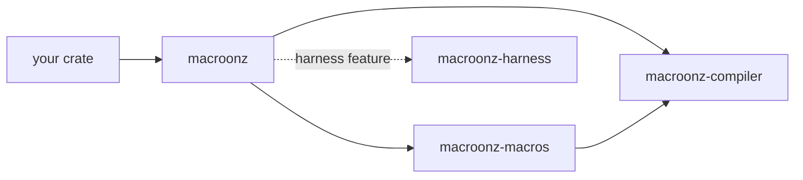
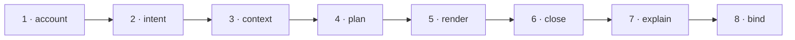

# Macroonz

<p align="center">
  
</p>

**Code generation that can prove what it made, and a test harness that tries to break it.**

Ferris bakes macaroons here.
Every batch starts from a written recipe, every tray is checked against that recipe before it leaves the oven, and a taste tester with no loyalty to the baker gets the first bite.

> Macroonz knows nothing about your domain.
> Your types, your errors, your identities, your bounds — all yours.
> It only knows how to bake exactly what you asked for, and how to find out whether it's any good.

---

## Why

Writing a derive macro means parsing a token stream, emitting another one, and hoping.
Nobody can say afterwards what was generated, why, or what would change it.
Testing a library means writing the examples you thought of.
The bug is in the one you didn't.

Macroonz replaces both hopes with records.

| You have | You get |
| --- | --- |
| A derive that emits tokens | An expansion that names every unit it produced, proves the set matches its plan, and explains each decision — before a byte reaches `rustc` |
| A handful of example tests | Generated inputs, injected faults, a controlled clock, mutants of your own code, and the reproduction material each road earns — generation keeps its seed when generation drove the run, reduction mints the smallest witness it reached, and the replay capsule carries it |

---

## The bakery

One storefront opens onto the oven, the hand that loads it, and the taste tester without pouring their vocabularies into one bowl.

| Crate | Directory | What it is |
| --- | --- | --- |
| **`macroonz`** | `/` | The storefront exposing the one `recipe!` workflow entrance while preserving the expert owners as `compiler`, `macros`, and feature-gated `harness` modules; this is the crate you add. |
| **`macroonz-compiler`** | `macros/compiler/` | The ordinary callable compiler that informs structural declarations, projects requested ordinary Rust or evidence material, then plans, renders, closes, explains, binds, and emits. |
| **`macroonz-macros`** | `macros/proc/` | The grammar-free procedural host carrying the recipe entrance and built-in declarations through compiler-owned doors with token conversion, span custody, diagnostic placement, and emission. |
| **`macroonz-harness`** | `harness/` | The judge. Descriptors, generation, properties, oracles, faults, corpus, fuzz composition, mutation, benches, reports, replay. The default storefront includes it; the diet posture removes it from a shipping graph. |



Arrows point at dependencies.
The compiler depends on nothing in this workspace.
The proc crate reaches the harness only from its tests, and the harness reaches the compiler only from its tests.

---

## Your recipe, your kinds

`macroonz::recipe!` is the one workflow entrance for declaring ordinary Rust ingredients, structural relationships and postures, effects, and requested projections.
The recipe vocabulary describes only the structure Macroonz must account over; complete authored Rust items remain authored Rust rather than becoming a parallel framework AST.

You own every name, item, vocabulary, relation, effect, policy, lawful answer, exact Rust fragment, requested projection, and independent behavioral claim.
Macroonz owns bounded capture, structural informing, exact accounting, mechanical projection, and the generation road that proves the requested output set was delivered whole.
Rustc remains the authority for paths, visibility, types, ownership, borrowing, lifetimes, coherence, exhaustiveness, const evaluation, and the final legality of the emitted Rust.

An ordinary Rust path is enough when Macroonz only needs to refer to a type, trait, function, effect, constructor, constant, module, associated item, or earlier generated item.
An explicit roster is required only when Macroonz must enumerate members or prove that every member received one disposition.

Authored items remain where they were written.
Generated companions remain inside the recipe module, private support remains in one hidden child, and public names, visibility, destinations, reexports, and unsafe boundaries remain explicit caller choices.
Within one recipe, Macroonz preflights every generated name it can derive from the declaration in the Rust namespace where that name will live: the `baked` module, companion constants and dispatch functions, relation-table and evidence modules, codec and transition refusal types, typestate, and an explicitly addressed support macro.
A collision inside that declared universe refuses the request before partial output, while imports, glob results, downstream macro output, and names generated by another recipe invocation remain ordinary rustc name-resolution authority.
No ambient scan or cross-recipe registry is performed, and no ordinary generated item is sprayed into the crate root or reexported automatically.

An evidence bake may carry an explicitly named support macro because Rust exports such macros at the declaring crate root.
That caller-authored address is the exception rather than an automatic reexport: its cargo stays inert, and the external test or bench target must invoke it with both the declaring-crate path and the harness path before any judgment exists.

The compiler's [recipe home](https://github.com/freebatteryfactory/Macroonz/blob/main/macros/compiler/src/recipe/README.md#evidence-projections) owns the exact contract for `declaration_conformance;` and `compile_contract;`.
Use a caller-authored harness property, oracle, or model comparison when judgment must be independent of the declaration.

The generic shape is ordinary Rust plus only the accounts a projection needs:

```rust
macroonz::recipe! {
    pub mod access {
        pub enum Stage { Draft, Published }
        pub enum Capability { Read, Write }

        bake! {
            vocabularies { Stage; Capability; };
            relations {
                policy(Stage, Capability) {
                    (Draft, Read);
                    (Published, Read);
                };
            };
            postures {
                policy { repetition(refused); };
            };
            projections {
                companions;
                relation_tables { policy; };
                typestate(Stage);
            };
        }
    }
}
```

The relation remains a structural account: Macroonz knows that each endpoint belongs to its declared roster and that repetition is refused, but it does not know what a stage, capability, or allowed policy means.
The preset relation table projects `baked::policy::contains(&Stage, &Capability)`, so ordinary code can use that checked account without rebuilding its membership loop.
Payload-bearing relations require an exact caller-authored lookup signature because the payload type remains caller authority; Macroonz supplies only the row-accounted `Some` or `None` body.
A same-roster evolution graph, a labeled many-to-many matrix, and a codec-only record use this same recipe entrance without pretending to be transitions.
When a recipe names `codecs`, those declarations select the existing compiler codec owner and its canonical methods rather than a parallel recipe encoding system.
When the ergonomic transition spelling is used, it lowers into one typed generic relation and unlocks the transition-specific dispatch projector.

One bake request admits progressively more precision without changing semantic models:

- A conventional bake supplies documented mechanical choices.
- A configured bake replaces named mechanical seats.
- An exact bake supplies caller-authored Rust for those same seats.
- A caller-owned projector consumes the same informed account and constrained output protocol through the callable compiler or a caller-owned proc host.

Projection syntax follows one grammar across the catalog:

```rust
dispatch; // documented conventional mechanics
dispatch(apply); // one flat configured name
dispatch {
    /// Applies one caller-declared transition or returns typed absence.
    pub fn advance(
        current: State,
        event: Event,
    ) -> Result<State, TransitionRefusal>;
}; // exact caller-authored Rust; Macroonz supplies only the checked body
```

Parentheses carry flat configuration names, while braces carry exact Rust material.
An exact dispatch signature owns its attributes, visibility, qualifiers, name, generics, two simple caller-named parameter bindings and types, result, and where clause.
The standard projector still owns the relation-accounted body; a caller-owned body belongs on the custom-projector road.

Two values for one seat refuse.
Semantic postures are stated once in the structural account and consumed by every projector that needs them.
Safe presets emit safe Rust, while an exact caller-authored unsafe boundary may be preserved or repeated only as explicit caller authority.

The callable `compiler` module remains the raw road for defining a new kind, grammar, or projection algorithm.
Its `Kind` and `Request` vocabulary exposes the same plan, render, closure, explanation, and expansion owners beneath the paved recipe surface rather than a second compiler model.

---

## The road

Every request walks the same eight steps, whatever the kind.
Each step hands the next a value it cannot forge.



1. **Account.** The kind-specific content bound to its exact captured declaration and owner-qualified kind, plus every independent captured dependency it declares.
2. **Intent.** What it means: an identity over the owner-qualified kind and content commitment. Two callers who meant the same thing derive the same intent.
3. **Context.** Which profile and which generator version are answering.
4. **Plan.** The complete output set, named before a byte of syntax exists — each unit's role, semantic key, destination, origin, expected profile, and digest contract — plus the invalidation set, the decision trace, and the nonclaims.
5. **Render.** Typed tokens into rendered units, each digested over its own canonical bytes.
6. **Close.** The membership is rebuilt from what was rendered and proved equal to the plan, role by role. The units are partitioned by the destination each one declared.
7. **Explain.** Every question the kind owes is answered once, over that plan and that closure, under an identity derived from both.
8. **Bind.** Plan, closure, and explanation are sealed together, after the compiler establishes that the three name one another.

The sealed expansion is the one value emission is read from.
`emit()` hands a proc macro its tokens; a test carrier, a bench carrier, or a publication step reads its own partition from the same value.

> A request that cannot walk the whole road is refused whole.
> There is no partial output.
> A refusal is never a smaller success.

Expansion is a function of its declared input.
No network, no filesystem scan, no environment, no clock, no entropy — there is no seat where one could enter.

---

## The taste test

You describe a subject once: what it takes, what it returns, what it refuses, what must hold.
The harness hands you the instruments — each independently callable, composed by your own tests rather than by one button:

- **Generates** inputs against the description, structure-aware, from a seed it records.
- **Injects** faults on a declared schedule, and measures against a clock the caller declares, so the subject is judged under pressure and not on a sunny day.
- **Reduces** a failure to the smallest witness reached under the declared reducers and budget, and mints a replay capsule over it.
- **Observes** stable-Rust targets compiled with rustc coverage instrumentation through the pinned toolchain's matching LLVM tools, retains coverage-novel bytes, and hands them into that same reduction and replay road.
- **Mutates** the subject's own code and runs the trials against each mutant, to prove the trials can tell right from wrong.
- **Benchmarks** with the same receiver and the same pinned profile, so a number means the same thing tomorrow.
- **Reports** each verdict with its standing, its site, and its complete denominator — joined to its replay capsule, where a reduction earned one, on one execution key.

Descriptors, trials, mutations, and benches live in your tests — written through the generic `macroonz::macros` attributes, through your own attributes, or by hand.
The harness owns how they are judged, never what they mean.
The stable coverage path remains one-package usage through `macroonz::harness::fuzz`; its [fuzz home](https://github.com/freebatteryfactory/Macroonz/blob/main/harness/src/fuzz/README.md#runnable-road) owns the runnable facade example and command.

---

## Getting started

1. Pick a posture from [The three postures](#the-three-postures).
2. Add `macroonz` with that command.
3. Start with `macroonz::recipe!`, or follow the [compiler README](https://github.com/freebatteryfactory/Macroonz/blob/main/macros/compiler/README.md) when you need a caller-owned projection algorithm.
4. Use the harness directly or through an evidence bake when an independent judgment is part of the recipe.

Runnable examples cross distinct public roads:

| Journey | Command | What it establishes |
| --- | --- | --- |
| First recipe | `cargo run --example recipe` | Conventional, configured, and exact projection levels through the root facade entrance. |
| Callable compiler | `cargo run -p macroonz-compiler --example callable_compiler` | One public compiler request plans, renders, closes, explains, binds, and emits a unit. |
| Direct handwritten property | `cargo run -p macroonz-harness --example temporal_property` | Caller-owned state and transitions enter a temporal contract without a macro or subject trait. |
| Exact compile contract | `cargo run --example compile_contract` | A caller-stated compiler observation is compared with an independently declared exact outcome. |
| Stable coverage composition | `cargo run --example rustc_coverage` | Stable rustc instrumentation supplies source-region novelty to corpus, reduction, and replay composition. |

The compile-contract example is intentionally the pure comparison half.
The caller that actually runs rustc or Cargo owns that effect, structured diagnostic extraction, and the provenance of the observation it supplies.

The shipped [Macroonz agent skill](skills/macroonz/SKILL.md) is a one-page routing surface for agents authoring recipes from the packaged facade.

Contribution procedure lives in [`CONTRIBUTING.md`](CONTRIBUTING.md).
Security reporting lives in [`SECURITY.md`](SECURITY.md).

---

## The three postures

Cargo features are additive, so the lighter postures are selected by turning off the default before adding back only the door wanted.

| Posture | Command | Surface |
| --- | --- | --- |
| **full** | `cargo add macroonz` | Recipe entrance, compiler, proc declarations, harness, and the target-qualified preemption backend as the default posture. |
| **diet-lite** | `cargo add macroonz --no-default-features --features harness` | Recipe entrance, compiler, proc declarations, and harness without Loom. |
| **diet** | `cargo add macroonz --no-default-features` | Recipe entrance, compiler, and proc declarations; harness-owned evidence bakes are typed unavailable. |

The `preemption` feature always implies `harness`.
On a native target supported by the pinned Loom backend, enabling `preemption` installs that backend.
On every other target, including Wasm, the same harness result plane remains available and reports typed backend unavailability instead of trying to compile Loom.

---

## Working here

[`AGENTS.md`](AGENTS.md) is the working law for anyone — person, model, or agent — who edits this repository, and it owns what enforcement means here.
[`CONTRIBUTING.md`](CONTRIBUTING.md#local-wall) owns the exact local wall rather than duplicating a second command surface here.
That wall exercises every feature together, including the target-qualified Loom-backed `preemption` exploration, and crosses the supported Wasm posture separately.
The pinned stable Rust 1.98 toolchain also installs `llvm-tools-preview`, whose matching `llvm-profdata` and `llvm-cov` binaries read profiles for the safe-Rust fuzz composition road.

---

## License

Licensed under either of [Apache License, Version 2.0](LICENSE-APACHE) or [MIT license](LICENSE-MIT), at your option.

Unless you explicitly state otherwise, any contribution intentionally submitted for inclusion in the work by you, as defined in the Apache-2.0 license, shall be dual licensed as above, without any additional terms or conditions.
