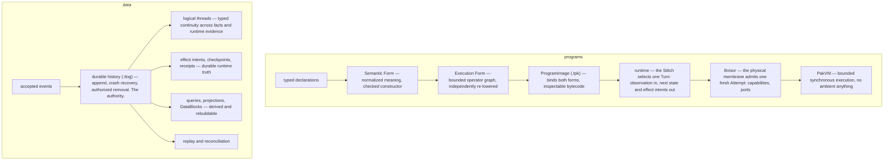
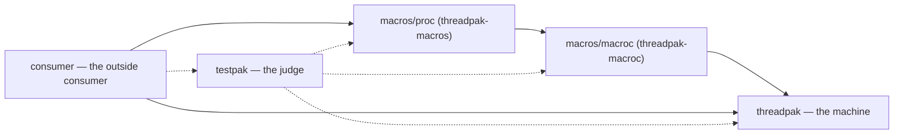

# ThreadPak

ThreadPak is an embedded, sync-first, event-native database and runtime — an
opinionated Rust library of semantic primitives. It preserves a logical thread:
a typed continuity from intent through accepted facts, bounded decisions, Turns,
Attempts, effects, receipts, replay, and reconciliation. The product is named
for that thread. Programs enter as typed declarations, not text; accepted
history is the authority; everything else is derived and rebuildable. Use it
where history must be trustworthy: audit trails, local-first state, compliance
evidence, event-sourced applications.

The ordinary path stays small: Store · Event · Query · Projection ·
Subscription · Program · Application · Receipt. Expert surfaces deepen the same
machine; none creates a second one.

## The machine in one view



Hosts live in other repositories and pin an exact ThreadPak revision. The
machine never knows which host is running it.

## Workspace

| Crate           | Role                                                 |
| --------------- | ---------------------------------------------------- |
| `threadpak`     | the machine — root package at the repository root    |
| `macros/macroc` | the generation services — package `threadpak-macroc` |
| `macros/proc`   | the Rust-facing expansion shell — `threadpak-macros` |
| `testpak`       | the testing harness — package `threadpak-testpak`    |
| `consumer`      | the outside consumer — package `threadpak-consumer`  |



Arrows point at what each crate depends on;
a dashed arrow is a dependency reached only from `tests/`.
Edges run one way and inward, and no production edge points at testpak:
production never depends on its judge,
so the judge reaches its three subjects — and its one outside consumer reaches it —
from `tests/` alone.
Hosts are one step further out, in other repositories,
so this repository has no `hosts/` directory.

## The band map

Numbered directories are dependency bands. An arrow means everything downstream
may import it: band N imports any band above it, never below. Homes materialize
only when their specification content lands; no directory exists empty.

The root also carries the depot — the bank of data-shaped truth every band
and every crate may read; a fact has no band.

```mermaid
flowchart TD
    R["root — types.rs shape calculus · depot data bank"]
    R --> B00["00 refusal — envelope, families, handling, ReasonId"]
    B00 --> B01["01 logic — three-valued logic, truth tables, finality"]
    B01 --> B02["02 identity — six identity classes, minting, scope guards"]
    B02 --> B03["03 value — bounded values, closed algebra, absence"]
    B03 --> B04["04 numeric — exact numeric families, intervals, quantization"]
    B04 --> B05["05 bounds — budget classes, typed magnitudes"]
    B05 --> B06["06 authority — capability and KeyScope algebra, meet, attenuation"]
    B06 --> B07["07 bytes — frame grammar, codecs, digest domains, byte roles"]
    B07 --> B08["08 schema — schema model, refinements, canonical profiles, migration"]
    B08 --> B09["09 time — the tick, deadlines, chronology"]
    B09 --> B10["10 history — accepted history, append, recovery, removal, federation"]
    B10 --> B11["11 navigation — frames, axes, addresses, Fix, source closure"]
    B11 --> B12["12 port — port contract algebra, host obligations"]
    B12 --> B13["13 declaration — authoring algebra: fragments, linker, facets"]
    B13 --> B14["14 semantic — the judgment, Semantic Form"]
    B14 --> B15["15 execution — operator register, lowering, agreement, Execution Form"]
    B15 --> B16["16 image — ProgramImage, .tpk, entrypoints, admission"]
    B16 --> B17["17 pakvm — the executor: values, arenas, the step machine"]
    B17 --> B18["18 bvisor — Attempts, reservation, ports, observations"]
    B18 --> B19["19 runtime — the Turn, the Stitch, checkpoints, replay, reconciliation"]
    B19 --> B20["20 derived — DataBlocks, masks, materialization"]
    B20 --> B21["21 application — composition, interfaces, Serve"]
    B21 --> B22["22 security — sealed extents, shred, revocation distribution"]
    B22 --> B23["23 evidence — receipts, verification, denominators, the evidence graph"]
```



## Construction

Product-runtime code enters a home only through explicit owner authorization.
The generation system is the product line: families are authored through front
doors and their contracts are generated. TestPak and the generation services are
constructed before per-home machine-source realization; the application compiler
follows the machine. That is construction order, not Cargo dependency order; the
workspace graph above remains authoritative.

The toolchain is the enforcement surface, run locally:

```sh
cargo check --workspace --all-targets   # the compiler, which is the enforcement
cargo clippy --workspace --all-targets  # the lint wall
cargo nextest run --workspace           # the lanes, which observe what types cannot
cargo fmt --all -- --check
cargo deny --workspace check             # licenses, sources, feature pins
```

## License

ThreadPak is licensed under either of

- Apache License, Version 2.0 ([LICENSE-APACHE](LICENSE-APACHE) or
  <http://www.apache.org/licenses/LICENSE-2.0>)
- MIT license ([LICENSE-MIT](LICENSE-MIT) or
  <http://opensource.org/licenses/MIT>)

at your option.

### Contribution

Unless you explicitly state otherwise, any contribution intentionally submitted
for inclusion in the work by you, as defined in the Apache-2.0 license, shall be
dual licensed as above, without any additional terms or conditions.
