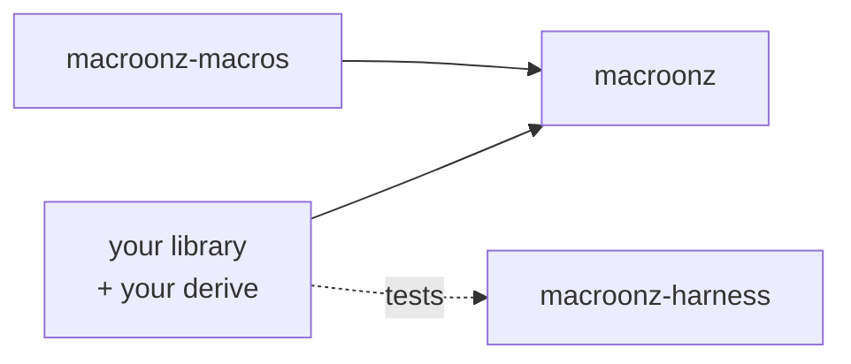
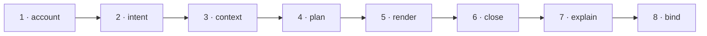

# Macroonz

**Code generation that can prove what it made, and a test harness that tries to break it.**

Ferris bakes macaroons here.
Every batch starts from a written recipe, every tray is checked against that recipe before it leaves the oven, and a taste tester with no loyalty to the baker gets the first bite.

> Macroonz knows nothing about your domain.
> Your types, your errors, your identities, your bounds — all yours.
> It only knows how to bake exactly what you asked for, and how to find out whether it's any good.

---

## Why

Writing a derive macro means parsing a token stream, emitting another one, and hoping.
Nobody can say afterwards what was generated, why, or what would change it.
Testing a library means writing the examples you thought of.
The bug is in the one you didn't.

Macroonz replaces both hopes with records.

| You have | You get |
| --- | --- |
| A derive that emits tokens | An expansion that names every unit it produced, proves the set matches its plan, and explains each decision — before a byte reaches `rustc` |
| A handful of example tests | Generated inputs, injected faults, a controlled clock, mutants of your own code, and the smallest witness for every failure, with the seed and the replay that reproduce it |

---

## The bakery

One crate is the oven, one is the hand that will load it, and one is the taste tester.

| Crate | Directory | What it is |
| --- | --- | --- |
| **`macroonz`** | `macros/compiler/` | The compiler, as ordinary functions. Capture a declaration, build a request, plan, render, close, explain, bind, emit. This is the crate you add. |
| **`macroonz-macros`** | `macros/proc/` | The generic entries: `#[trials]`, `#[bench]`, and `#[mutations]`, each expanding to one inert exported carrier beside the item it decorates, and the three direct declarations — `shadow!` for two-faced synchronization imports, `network!` for a topology's builder module, `concurrency!` for declared interleaving explorations. It owns no grammar — every reading and every road is the compiler's. |
| **`macroonz-harness`** | `harness/` | The judge. Descriptors, generation, properties, oracles, faults, corpus, mutation, benches, reports, replay. A dev-dependency — production never depends on it. |



Arrows point at dependencies.
The compiler depends on nothing in this workspace.
The harness reaches the generation crates only from its own tests.

---

## Your recipe, your kinds

A **kind** is a thing you can ask Macroonz to generate: one `impl` block, a codec pair, a test carrier, a documentation page.
You define it.
A kind says what content it is rendered from, which roles its output units play, and which questions its explanation has to answer.
The compiler is generic over all of that; it has never heard of your kind and does not need to.

```rust
use macroonz::{Kind, NoQuestions, Request};

/// One `impl Greet` for the declared type.
#[derive(Debug, Clone, Copy, PartialEq, Eq)]
struct GreetImpl;

impl Kind for GreetImpl {
    const NAME: &'static str = "greet.impl";
    type Content = Greeting;
    type Role = GreetRole;
    type Question = NoQuestions;
}

pub fn greet(input: TokenStream) -> TokenStream {
    macroonz::host::expand(input, |capture| {
        let greeting = Greeting::read(&capture)?;
        Request::<GreetImpl>::over(capture, greeting, &GREET_DOOR)
            .render(|plan, out| out.unit(GreetRole::Impl, plan.content().impl_tokens()))
    })
}
```

`Greeting::read` is yours: your grammar, your rules, your refusals.
`GREET_DOOR` is the one value that says who is asking — the diagnostic prefix your users read, and the stable names every identity carries.
Macroonz never parses your declaration for you and never decides what it means.
This is the same split `serde` makes — `serde_derive` ships with `serde`, not with `syn` — and it is the only split that keeps a generator honest.

---

## The road

Every request walks the same eight steps, whatever the kind.
Each step hands the next a value it cannot forge.



1. **Account.** What the request stands on: the captured declaration and every captured dependency, committed under one identity.
2. **Intent.** What it means: an identity over the kind's name and that commitment. Two callers who meant the same thing derive the same intent.
3. **Context.** Which profile and which generator version are answering.
4. **Plan.** The complete output set, named before a byte of syntax exists — each unit's role, semantic key, destination, origin, expected profile, and digest contract — plus the invalidation set, the decision trace, and the nonclaims.
5. **Render.** Typed tokens into rendered units, each digested over its own canonical bytes.
6. **Close.** The membership is rebuilt from what was rendered and proved equal to the plan, role by role. The units are partitioned by the destination each one declared.
7. **Explain.** Every question the kind owes is answered once, over that plan and that closure, under an identity derived from both.
8. **Bind.** Plan, closure, and explanation are sealed together, after the compiler establishes that the three name one another.

The sealed expansion is the one value emission is read from.
`emit()` hands a proc macro its tokens; a test carrier, a bench carrier, or a publication step reads its own partition from the same value.

> A request that cannot walk the whole road is refused whole.
> There is no partial output.
> A refusal is never a smaller success.

Expansion is a function of its declared input.
No network, no filesystem scan, no environment, no clock, no entropy — there is no seat where one could enter.

---

## The taste test

You describe a subject once: what it takes, what it returns, what it refuses, what must hold.
The harness hands you the instruments — each independently callable, composed by your own tests rather than by one button:

- **Generates** inputs against the description, structure-aware, from a seed it records.
- **Injects** faults on a declared schedule, and measures against a clock the caller declares, so the subject is judged under pressure and not on a sunny day.
- **Reduces** a failure to the smallest witness reached under the declared reducers and budget, and mints a replay capsule over it.
- **Mutates** the subject's own code and runs the trials against each mutant, to prove the trials can tell right from wrong.
- **Benchmarks** with the same receiver and the same pinned profile, so a number means the same thing tomorrow.
- **Reports** each verdict with its standing, its site, and its complete denominator — joined to its replay capsule, where a reduction earned one, on one execution key.

Descriptors, trials, mutations, and benches live in your tests — written through the generic `macroonz-macros` attributes, through your own attributes, or by hand.
The harness owns how they are judged, never what they mean.

---

## Working here

[`AGENTS.md`](AGENTS.md) is the working law for anyone — person, model, or agent — who edits this repository, and it owns what enforcement means here.
The wall it names, run locally:

```sh
cargo check  --workspace --all-targets --all-features
cargo clippy --workspace --all-targets --all-features
cargo nextest run --workspace --all-features --run-ignored all
cargo fmt --all -- --check
cargo deny --workspace check
```

The wall runs with every feature on, so the optional homes — the loom-backed `preemption` exploration among them — are proven on every run while the default build stays lean.

---

## License

Licensed under either of [Apache License, Version 2.0](LICENSE-APACHE) or [MIT license](LICENSE-MIT), at your option.

Unless you explicitly state otherwise, any contribution intentionally submitted for inclusion in the work by you, as defined in the Apache-2.0 license, shall be dual licensed as above, without any additional terms or conditions.
