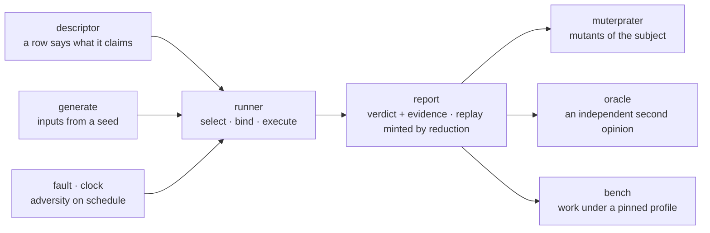

# macroonz-harness

The taste tester.
It has no loyalty to the baker, no opinion about the recipe, and it records everything.

You describe a subject once — what it takes, what it returns, what it refuses, what must hold — and its instruments spend the rest of their time trying to make that description false: independently callable engines a caller composes, not one pipeline behind one button.
A verdict comes back as two separately earned values that join on one execution key: the report, which carries the standing, the site, and the complete denominator of what ran; and the replay capsule, which a completed reduction mints over the exact minimized input — so a failure is a thing you can hold rather than a thing you saw once, and neither value claims what the other proved.

The harness belongs in test and tooling code, and it never depends on the crates it judges.
The `macroonz` facade includes its API by default so one dependency opens the complete machine; a shipping crate that wants no judge selects the diet posture.

## Direct handwritten property

A subject does not need a Macroonz macro, trait, or registration step before the harness can judge it.
The runnable `temporal_property` example declares a handwritten transition system, proves one lawful history, and requires one hostile history to produce a typed finding:

```console
cargo run -p macroonz-harness --example temporal_property
```

The example leaves state, input, transition meaning, and the boundedness rule with the caller.
The harness contributes only the temporal contract, the whole-history reading, and the typed conclusion.

## Recipe evidence

A recipe may request mechanical carrier material for an existing harness constructor, but the compiler never decides the resulting claim.
The compiler's bounded descriptor adapter renders the declared constructor call, the generated carrier remains inert until an external target invokes it, and this crate alone owns the judgment and report standing.
The invocation states both the declaring-crate path and this harness path, then the existing schema gate admits both carrier seats or withholds both before type checking.

The handwritten road remains at least as capable as the generated road.
Removing the facade's harness feature leaves ordinary Rust and compiler recipe projections available while making harness-owned evidence bakes typed unavailable through the same recipe contract.

---

## What you write

A row per trial, in your own tests, through the `trial_table!` stamp or by hand.

```text
macroonz_harness::trial_table! {
    /// Every trial this crate authored for its lots.
    mod lots named("bakery", "lots") {
        provenance: unproduced,
        invocation: InvocationProfile::declared(
            CaseBudget::declared(64),
            ByteBudget::declared(4096),
            TimeBudget::declared(1_000_000_000),
        ),
        target: TargetBinding::bound(
            TargetTriple::declared(TARGET),
            ToolchainIdentity::declared(TOOLCHAIN),
        ),
        clock: HarnessClock::unavailable(),

        suite merge named("bakery", "merge") {
            a_full_lot_refuses_one_more: {
                let (row, attachment) = merge_parts("a-full-lot-refuses-one-more")?;
                Binding::bound(row, attachment, Provenance::Unproduced)
            },
        }
    }
}
```

`merge_parts` is yours: an ordinary function composing the `Row` — its claim, suite, classification, subject, check, population, and origin — and the `ExecutableAttachment` that runs it, through the descriptor home's public constructors.
Every clause and every row ends with a comma, because the stamp's grammar says so and refuses the one that doesn't.

One stamp writes the authored world: an aggregate test per suite and a named lens per row.
A row names a **claim** (what is being established), a **subject** (the road under test), a **check** (what decides), and a **population** (where the inputs come from), each as a namespaced name you own.
The harness stores your names, hashes your names, and never reads inside them.

`target` and `clock` are declared at the invocation because the harness derives no host fact of its own: a cache key with a guessed toolchain in it is a lie with a digest.

---

## What it does with it



| Home | What it does |
| --- | --- |
| `descriptor/` | What one trial states about itself: claim, subject, check, population, roles, tags, origin, and the two-sided schema pin a generated row must match. |
| `runner/` | Selection, binding, execution, and the verdict: a row plus an executable attachment becomes a trial report. |
| `generate/` | Deterministic inputs from a recorded seed, a shared sequence driver, and fingerprint-preserving minimization — a failure shrunk to the smallest witness reached under the declared reducers and budget. |
| `properties/` | The algebraic laws a subject can be held to: equivalence, order, metamorphic relations, parity between two roads, composition, temporal contracts, refusal postures. |
| `fault/` | Adversity the owner schedules: which fault, at which call. |
| `clock/` | A clock the harness reads but never owns. Time is an input. |
| `corpus/` | Warm starts from content-addressed seed packs. |
| `fuzz/` | Thin safe-Rust composition over stable rustc coverage instrumentation and LLVM tools derived from that exact compiler: active informed readiness, root-independent coverage identity, deterministic neighboring inputs, novelty retention, safe isolated execution, and interesting-byte handoff into reduction and replay. |
| `interleave/` | Deterministic exploration of how declared strands can merge, treating the schedule as generated input and retaining the exact order behind each reading. |
| `network/` | A deterministic message-passing simulation over caller-declared topology, delivery, and fault facts, whose command-shaped deliveries can enter interleaving exploration. |
| `preemption/` | Feature-gated instruction-level concurrency exploration through a target-qualified backend, with typed unavailability wherever that backend cannot lawfully run. |
| `report/` | What a run leaves behind: trial identities, revision identities, execution keys, fingerprints, replay capsules, coverage, comparison. |
| `oracle/` | An independent second opinion where self-agreement would be vacuous: golden vectors, an independent transcript, a structural read of generated source, a compiled read-back. |
| `muterprater/` | Mutation pressure: which damages a subject may suffer, pressing them, and refusing to let a run claim more than its evidence affords. Four evidence roads stay physically distinct. |
| `bench/` | Work measured under a pinned receiver and profile, with complexity claims and planted-worse controls, so a number means the same thing tomorrow. |
| `depot/` | The harness's own fact bank: the mutation-operator taxonomy and the separations among its own types. Nothing product-shaped is banked here. |
| `identity/` | One derivation substrate: domain-tagged, versioned content addresses. |

---

## What stays yours

Every seat where meaning enters is a type parameter with no bound, a capture-free function pointer, or a name you declared.

- Equality is your `Equivalence`; order is your `Order`; a refusal is read through your `ResponseReading`.
- A check hands back a `TrialConclusion`: passed, or refused with a finding whose cause is a `(family, local)` pair you spell.
- A mutation discovery names points, claims, and operator families you declared; the harness intersects them with your own permission table and invents no attribution.
- The artifact under a structural read is described as plain strings — a target, a trait path, attributes — that you wrote beside the declaration you handed the producer.

There is no trait a subject must implement.

---

## Evidence, not green

A passing lane is a side effect.
What the harness is for is the record: which claim was exercised, under which revision of the subject and which revision of the check, on which target, under which budgets — that is the report's half.
The reproduction is the replay capsule's half, earned separately: a completed reduction mints one over the smallest input reached under the declared reducers and budget, bound to the same execution key the report carries, so the two halves join without either claiming the other.

Four things a verdict never does: misattribute a failure, drop an observation, fabricate evidence, or claim a kill without a qualified baseline.
