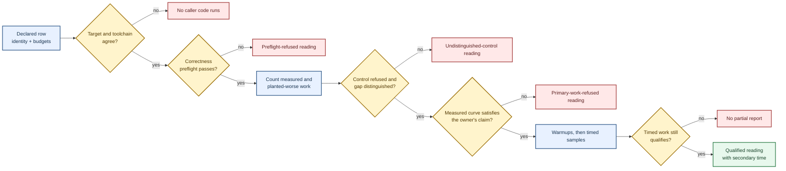

# bench — a number that means the same thing tomorrow

A wall-clock number on its own is a rumor.

Run the same code twice and the timings disagree.
Move it to another host or place it beside noisy work and they disagree more.
This home therefore qualifies a benchmark from declared work before it observes time.

## The evidence road

A benchmark row declares the workload, input axis, correctness preflight, planted-worse control, budgets, contention posture, optional formula, and complexity claim that give one comparison meaning.
Its `BenchRowKey` changes whenever one of those facts changes, so readings from different declarations cannot quietly share a row identity.

The executable attachment supplies the measured callable, the planted-worse callable, the owner-written judge, and the work observations those callables may record.
`BenchBinding` joins the declaration to that target-owned execution material only when their semantic names agree.

The complete execution order and the exact row-identity preimage are caller contracts on the public operations that establish them.
Independent external observations rederive the identity and reverse every qualifying gate.

## The judge and recorder

`WorkJudgmentInput` carries the formula, complexity claim, budgets, measured curve, and planted-worse curve.
It carries no duration, measurement reading, or clock, so qualification cannot depend on wall time.

A `WorkRecorder` is scoped to the observation roster in its attachment.
It refuses an observation outside that roster and refuses arithmetic overflow rather than inventing or wrapping work.

The planted-worse control makes the instrument falsifiable.
If the owner judge cannot reject the control and establish the declared exact gap, the measured curve does not qualify for timing.

## The report boundary

`BenchReport` retains one reading per authored binding, in authored order, and only this home can mint it.
Each reading keeps the complete row, the target it stood on, the preflight report, and the evidence for the stage it reached.
`bench_verdict` names the first row that did not qualify.

A renderer may read a completed report.
It cannot mint a report, reach a callable or judge, change a stage, or change the denominator.

## Ownership

The public owner remains `macroonz_harness::bench`.
The private declaration owner holds row meaning and row identity, while the private work owner holds scoped recording, work curves, owner judgment, and executable attachments.
Host execution joins those values to caller-declared target and clock facts without creating a new public child path.

## Nonclaims

This home is not a benchmark backend and does not define what fast means.
It fits no curve, applies no universal threshold, and does not interpret an owner's formula or complexity claim.
It reads no ambient host fact: target, toolchain, clock, and contention posture arrive as declared inputs.
Wall time remains a secondary observation of work that already qualified.
