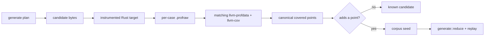

# fuzz

Stable Rust 1.98 supplies the coverage sensor; this home composes that observation with Macroonz campaign semantics.

## Boundary

An adopter compiles a Rust target with stable `-C instrument-coverage` and declares the absolute rustc executable, instrumented target, logical and physical source root, and scratch directory.
[`observe_rustc_profile`] runs one candidate in a fresh child process, reads the emitted profile through the matching `llvm-profdata` and `llvm-cov` binaries, and returns canonical covered source points.
It materializes the exact candidate beneath the case directory before the child starts and opens that file as standard input, so pipe capacity cannot block before the supervisor receives the process.
The Macroonz-owned implementation uses only safe Rust and the standard library; rustc and its matching LLVM tools remain compiler machinery outside the shipped Rust dependency graph.
It introduces no `Frida`, `LibAFL`, native instrumentation library, `FFI` wrapper, general fuzz-engine dependency, nightly toolchain, feature, or additional Cargo package.

[`preflight_ready`] executes that exact rustc path, requires stable Rust 1.98, reads its host, sysroot, and LLVM version, derives `llvm-profdata` and `llvm-cov` from that same sysroot and host, and requires both tools to report the compiler's LLVM version.
It also inspects the target and declared source directory and canonicalizes the source root before constructing the sole [`ReadyPreflight`] value accepted by execution.
Preflight accepts no caller-supplied availability booleans or LLVM tool paths.
Preflight cannot inspect how an existing target was compiled; successful execution that emits a readable profile establishes usable coverage instrumentation, and the facade example performs that compilation explicitly.
The caller-supplied supervisor owns deadlines, resource policy, and the typed success, nonzero, crash, timeout, or resource-exhaustion classification.
Once a target starts, the operation returns only after the child is reaped or with a typed cleanup refusal recording that termination or reaping failed after the original refusal.
That split keeps ambient time and operating-system policy outside this home while preserving a truthful cleanup result.

[`CoverageCorpus`] owns the small feedback frontier.
It retains a candidate only when its observation adds a previously unseen point.
Coverage identity is independent of the absolute checkout root: the same instrumented source and execution under a different checkout directory produce the same canonical observation.
An absolute workspace prefix never becomes novelty.
[`neighboring_inputs`] deterministically expands one retained input through bounded safe byte operations and a caller-declared dictionary.
Enumeration has one declared priority order: bit flips, boundary substitutions, checked increments and decrements, deletions, boundary insertions, duplications, an optional splice, then dictionary insertion.
The mutation budget truncates that order to a deterministic prefix, so a small budget does not promise fairness or representation from every mutation family.
The ordinary [`crate::corpus`] owner remains responsible for content-addressed seed packs and warm starts.
The ordinary [`crate::generate`] owner remains responsible for deterministic candidate streams, budgets, accounting, reduction, and replay.



## Composition

[`read_lcov`] reads line and branch rows that the matching toolchain actually exports and ignores zero-count rows.
This home does not claim AFL-style edge coverage.
Stable line or region-derived coverage is the initial feedback signal, while explicit rustc branch-coverage modes remain outside the stable denominator.

[`preflight_ready`] executes the declared absolute compiler, inspects the declared target and source root, carries the declared absolute scratch path, and reads the compiler-owned sysroot and matching tool paths it derives from them.
It performs no network access and does not accept ambient environment claims as readiness.

[`compose_reduce_replay`] runs the existing [`crate::generate::reduce()`] and [`crate::generate::capture_replay`] roads under a [`crate::generate::ReductionProbeBinding`] the caller already opened from a refused report.
Interesting bytes enter as the reduction seed; coverage points remain search compass unless the caller separately makes them part of a failure fingerprint.

## Runnable road

The facade-level [`examples/rustc_coverage.rs`](../../../examples/rustc_coverage.rs) road uses the same one `macroonz` package an adopter installs.
It resolves the pinned stable rustc, compiles a small subject with `-C instrument-coverage`, establishes active readiness, executes distinct and repeated candidates, retains only coverage-novel bytes, builds an ordinary seed pack, and hands interesting bytes into reduction and replay.
Run it from the package root:

```sh
cargo run --example rustc_coverage
```

The example is an existing package target and needs no separate Cargo package or qualification workspace.

## Limits

The fresh-process profile loop pays process and LLVM-tool startup cost for every candidate and does not claim in-process fuzz-engine throughput.
Timeout and resource-exhaustion classifications state the supervisor's declared result unless a separate operating-system crossing establishes causal enforcement.
Raw profiles and campaign build output remain disposable under `target/qualification`.
