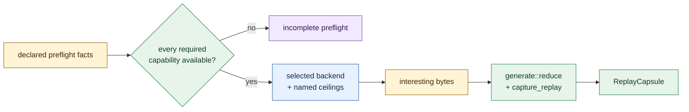

# fuzz

Coverage-guided search is an external witness; this home owns the Macroonz campaign shell around it.

## Boundary

A selected native backend admits interesting bytes.
Macroonz owns campaign declaration, typed preflight facts the caller supplies, failure fingerprint, reduction, replay, and named ceilings.
This home does not own edge maps, schedulers, mutators, executors, or process isolation.

The F0 selection is `LibAFL` plus Frida under explicit ceilings recorded with the selection receipt.
Linux and macOS remain credible-but-unexecuted until Wave F hosts establish native Macroonz receipts.
The engine loop and instrumentation stay in qualification tooling or an optional future feature road; they are not smuggled into default product dependencies here.

## Composition

[`compose_reduce_replay`] runs the existing [`crate::generate::reduce`] and [`crate::generate::capture_replay`] roads under a [`crate::generate::ReductionProbeBinding`] the caller already opened from a refused report.
Interesting bytes enter as the reduction seed; Frida edges remain search compass unless the caller declares them as the fingerprint.

[`preflight_ready`] judges only the facts it is handed.
It never scans the filesystem, environment, or network.

[`corpus`](crate::corpus) still owns seed packs and warm starts.
[`muterprater`](crate::muterprater) still owns pressure-lane vocabulary that names a fuzz road.
This home does not duplicate those owners.

## Evidence ceiling

Selection pins and ceilings are typed constants and values, not ambient discovery.
A host disposition of credible-unexecuted is an honest F0 posture, not an executed receipt.
Runnable Frida choreography remains outside this package until a separately disposed feature or durable qualification driver carries the process and linker posture the Windows pilot named.
