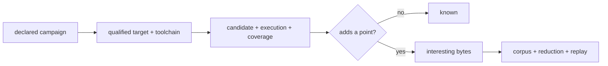

# fuzz

This home turns stable rustc source coverage into a bounded search signal while leaving Macroonz's existing corpus, generation, reporting, reduction, and replay owners in charge of their own semantics.

## Claim

[`CoverageCampaign`] declares the population, subject revision, coverage interpretation, and every resource ceiling before a host is consulted.
[`preflight_ready`] joins that declaration to the target triple and toolchain identity reported by the exact stable Rust 1.98 compiler that owns the matching LLVM tools.
The resulting [`ReadyPreflight`] is the only door into execution.

[`observe_rustc_profile`] owns the join from exact candidate bytes to one supervised process outcome and its canonical coverage observation.
The caller cannot substitute bytes, a campaign, a target, or a toolchain after that observation exists.
[`CoverageCorpus`] accepts only a joined result from its own qualified standing and mints [`InterestingBytes`] only when a successful execution adds a previously unseen point.
An adopter cannot manufacture that admission directly.

Coverage points use the caller-declared logical source root and paths relative to its canonical physical root.
Moving equivalent source between physical roots therefore preserves coverage identity while absolute checkout paths never become novelty.

## Ownership

Stable rustc and its matching `llvm-profdata` and `llvm-cov` binaries supply source-coverage mechanism.
The caller-supplied supervisor supplies deadline and operating-system resource policy and returns the typed execution class.
This home supplies the qualified join, canonical point identity, novelty frontier, and deterministic neighboring-byte exploration.
The ordinary [`crate::corpus`] home owns retained seed packs and warm starts.
The ordinary [`crate::generate`] home owns generated streams, reduction, and replay.
The ordinary [`crate::report`] home owns execution reports and target facts.

The Macroonz-owned implementation is safe Rust and adds no native instrumentation library, FFI wrapper, general fuzz-engine dependency, nightly toolchain, feature, or Cargo package.

## Resource closure

[`CoverageBudgets`] closes target attempts, cumulative candidate bytes, per-case coverage-export bytes, accumulated canonical points, retained cases, and retained bytes.
A refusal spends only work already attempted and never partially advances the novelty frontier.
Each case has one task-created directory beneath the declared scratch root, and execution removes that exact directory after success or refusal.
Raw profiles and compiled campaign subjects remain disposable build output under `target/qualification`.

[`neighboring_inputs`] expands a retained input through a deterministic, caller-bounded sequence of safe byte operations.
Its budget selects an exact priority prefix and does not imply fairness among mutation families.

## Composition

[`read_lcov`] retains executed line and branch rows that the stable toolchain actually exports.
This is stable source-coverage guidance, not an AFL-style edge-coverage claim.
Explicit rustc branch-coverage modes remain outside the stable denominator.

[`compose_reduce_replay`] hands coverage-earned bytes to an already-qualified [`crate::generate::ReductionProbeBinding`].
Coverage guides search, while the existing failure fingerprint remains the authority for reduction and replay.



## Runnable road

The facade-level [`examples/rustc_coverage.rs`](../../../examples/rustc_coverage.rs) target compiles a small Rust subject, proves coverage novelty and repeatability, retains a seed pack, and crosses one coverage-earned input into reduction and replay.
It uses the same `macroonz` package an adopter installs and no separate qualification package.

```sh
cargo run --example rustc_coverage
```

## Limits

Fresh target and LLVM-tool processes trade throughput for simple isolation and exact per-case custody.
Timeout and resource-exhaustion values are supervisor classifications unless a separate operating-system crossing proves causal enforcement.
