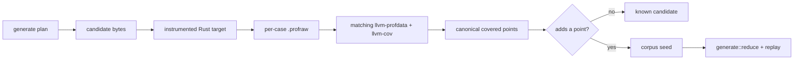

# fuzz

Stable rustc supplies the coverage sensor; this home composes that observation with Macroonz campaign semantics.

## Boundary

An adopter compiles a Rust target with stable `-C instrument-coverage` and declares the exact target, matching LLVM tools, scratch directory, and process supervisor.
[`observe_rustc_profile`] runs one candidate in a fresh child process, reads the emitted profile through `llvm-profdata` and `llvm-cov`, and returns canonical covered source points.
It uses only safe Rust and the standard library.
It introduces no native instrumentation library, FFI wrapper, general fuzz-engine dependency, feature, or additional Cargo package.

The caller-supplied supervisor owns waiting, deadlines, resource policy, termination, and the typed success, nonzero, crash, timeout, or resource-exhaustion classification.
That port keeps ambient time and operating-system policy outside this home while preserving process isolation.

[`CoverageCorpus`] owns the small feedback frontier this repository was missing.
It retains a candidate only when its observation adds a previously unseen point.
[`neighboring_inputs`] deterministically expands one retained input through bounded safe byte operations and a caller-declared dictionary.
The ordinary [`crate::corpus`] owner remains responsible for content-addressed seed packs and warm starts.
The ordinary [`crate::generate`] owner remains responsible for deterministic candidate streams, budgets, accounting, reduction, and replay.

## Composition

[`read_lcov`] reads line and branch rows that the matching toolchain actually exports and ignores zero-count rows.
This home does not claim AFL-style edge coverage.
Stable line or region-derived coverage is the initial feedback signal, while explicit rustc branch-coverage modes remain outside the stable denominator.

[`preflight_ready`] judges only caller-supplied facts.
It never scans the filesystem, environment, or network.

[`compose_reduce_replay`] runs the existing [`crate::generate::reduce()`] and [`crate::generate::capture_replay`] roads under a [`crate::generate::ReductionProbeBinding`] the caller already opened from a refused report.
Interesting bytes enter as the reduction seed; coverage points remain search compass unless the caller separately makes them part of a failure fingerprint.

## Evidence ceiling

The stable Rust 1.98 Windows pilot established distinct, repeatable coverage observations, deterministic neighboring inputs, discarded known-coverage neighbors, and an evolved retained corpus.
Linux and macOS remain unexecuted host dispositions until native hosts establish their own receipts.
The fresh-process profile loop is intentionally slower than an in-process instrumentation engine.
The Windows crossing also transports an actual abort and planted supervisor stops into crash, timeout, and resource-exhaustion classes.
The planted stops prove typed composition, not elapsed-time or operating-system resource causality.
Raw profiles and campaign build output remain disposable under `target/qualification`.
