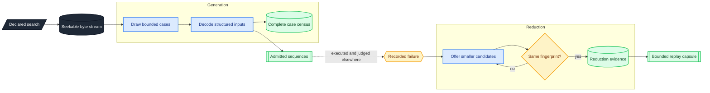

# generate — deterministic search becomes reproducible evidence

The generation road turns a declared search into deterministic inputs and an honest account of every case it reached.
The reduction road turns one recorded failure into a smaller reproducer without leaving that failure's fingerprint.
This parent composes those owners and preserves their established public roads without becoming a third semantic machine.

## Deterministic search

A generated byte stream is addressed from declared input alone and can be read at any position without replaying the positions before it.
Extending a search window therefore preserves the exact prefix already explored instead of renaming or reseeding it.

Generation keeps accounting separate from stopping posture.
The census says what became of every reached case, while the halt says why the road ended, so rejected or unavailable work cannot disappear from the denominator.

## Fingerprint-preserving reduction

Reduction begins from a failure already recorded by the report owner and admits a smaller candidate only when the bound probe reproduces the same fingerprint.
Owner-supplied semantic candidates may lead the search, and the generic byte road continues under the same admission law and finite budget.

The result is the smallest input this declared reduction reached, not a claim of global minimality.
A replay capsule is earned only after completed reduction evidence joins the report standing, input lineage, reducer custody, and replay ceiling.

## Boundaries

Generation does not execute a subject or judge a command sequence.
Reduction does not interpret bytes, choose owner-semantic candidates, or strengthen the reproduction authority carried by its inputs.
Neither road reads a clock, environment, filesystem, network, or operating-system random source.

The exact constructors, bounds, disposition roster, identities, and callable seams live with their public items.
The private [`generation`](generation/README.md) and [`reduction`](reduction/README.md) homes own the two vocabularies and operation roads.
