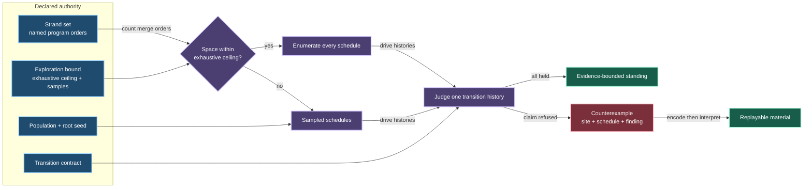

# interleave

This home treats a schedule as declared input and judges command-order concurrency without running threads or reading a clock.

Two parties can each behave lawfully alone and still break when their steps merge in one particular order.
The interleave owner makes that order a value which can be counted, generated, replayed, reduced, and held beside the finding it produced.

## Mental model

A strand is one named party's nonempty command sequence.
A strand set preserves each party's program order while admitting every cross-party merge.
An interleaving is the canonical choice string naming which live strand contributes the next command.
Material is the byte-string input from which that canonical choice string is interpreted.

## Evidence ceiling

An exhaustive walk is available only when the counted space fits the declared ceiling.
Its clean standing covers every interleaving in that space.

A larger space is sampled through the harness's shared seeded generation road.
Its clean standing covers only the schedules actually drawn, and the mode, census, halt, and explored count retain that narrower claim.
No sampled result can wear the exhausted-space standing.

The counterexample owns the canonical schedule and typed finding at the site where exploration found it.
Encoding that schedule and interpreting the resulting material reconstructs the same merged command history without hidden state.

## Composition

Fault injection composes before strand declaration, so adversity remains owned by the fault home and the resulting commands remain ordinary strand input here.
Network deliveries are command-shaped values and per-link delivery sequences can therefore become strands without teaching either owner the other's vocabulary.
Reduction can transform material because every byte string interprets to a lawful schedule and unused suffix bytes carry no effect.

## Boundary

Each command is one atomic step at this floor.
Instruction-level preemption and memory-model behavior belong to the target-qualified preemption owner.
Delivery timing and network discipline belong to the network owner.

This home performs no partial-order reduction.
Commuting schedules are still distinct schedules, so an exhaustive standing covers the literal declared space rather than an unproved equivalence class.
