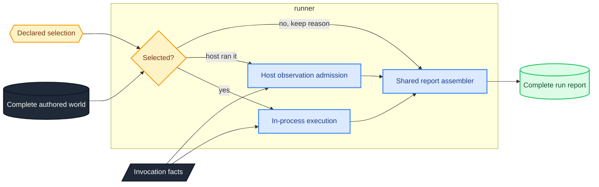
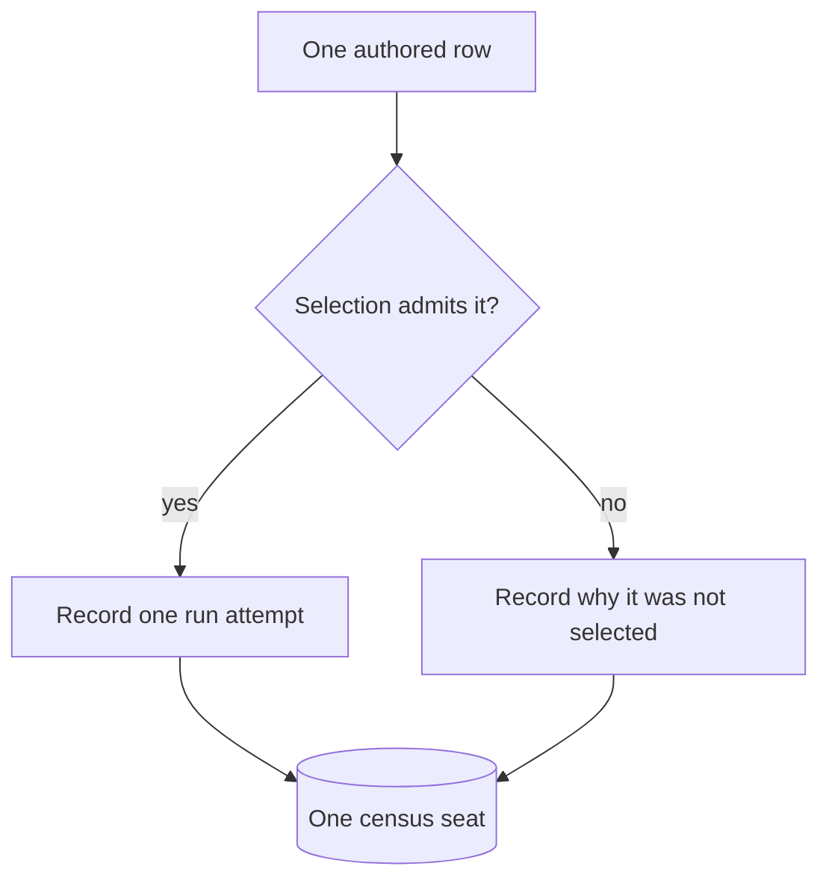

# runner — declared trials become evidence

The runner is the harness's execution engine.
It receives the complete authored world, a declared selection over that world, and one invocation, then returns a report without discovering, scanning, printing, exiting, or retaining run state.

## One meaning, two admission roads

An in-process call and an external host observation are two ways to establish the attempt axis, not two report engines.
Both roads enter one assembler, which derives the standing a host cannot author from the binding, invocation, table, and selection.

A host may state only the semantic trial it ran, what became of the attempt, and the wall reading it observed.
The join refuses records that are duplicated, outside the table, outside the selection, or absent for a selected trial.

## The complete table is the denominator

A selection chooses from the authored world and never shrinks it.
Every report accounts for every row, recording either a selected attempt or the reason that row was passed over.

The selection disposition is established before execution, so a row nobody ran cannot become an attempt that failed.
A row remains data; its capture-free callable rides beside it in the binding, and no hidden registry maps rows to functions.

## Empty work is declared in advance

A selection plan states both what to choose and whether choosing nothing is an admitted result.
The ordinary posture expects at least one row.
The explicit zero-work posture carries its closed reason into the report, and no verdict reads that result as a passing trial.

## Verdicts fold typed records

The aggregate-seat fold reads the selection outcome and every selected report.
The single-lens fold reads one trial report.
Both carry typed failure facts out of the record rather than interpreting prose, and a cache-satisfied skip still refuses because the conclusion it stands in for is absent from the report being judged.

## Host facts remain declared facts

The invocation carries the target, toolchain, budgets, site, and clock.
The engine derives none of them from ambient process state and does not let elapsed-time availability change a check's conclusion.

## The panic boundary

A subject panic that unwinds is recorded as a typed subject finding.
The unwind catcher retains a safely readable payload while one process-global hook observes the origin, chains the hook that preceded it, and correlates observations per thread.

The hook is installed once.
A later process-wide replacement can remove origin capture, so the payload remains evidence while the origin becomes unavailable.

An abort or stack overflow does not unwind and therefore cannot produce a trial finding in process.
Process isolation may establish that ceiling, but hosting the process is outside this home.

## What this home does not own

The runner owns neither a command protocol nor hosting policy.
Argument parsing, output streams, exit codes, listing, filtering, sharding, and process supervision belong to the caller's host.
Comparing reports belongs to the report home, over the records this home produced.
