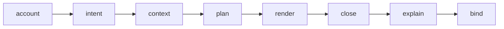

# macroonz-compiler

The compiler.
A complete request goes in; one sealed expansion comes out, or one diagnostic that says exactly why not.

This crate is ordinary callable Rust.
Its default build knows no proc macro: the `host` feature is the one opt-in bridge to `proc_macro`, and everything outside that feature is plain functions over plain values.
The generic kernel knows nothing about what you are generating; the `descriptor` home is the one stated exception, the first-party adapter that speaks this workspace's own harness vocabulary.
The paved recipe road and the raw callable road meet at the same informed structure, projection authority, and sealed expansion.

---

## Declare, inform, compose, project

A recipe hands the compiler caller-owned Rust items, explicit structural facts and postures, ordinary Rust paths, and requested projections.
The compiler informs only the structure it must account over, offers each planned projection to a standard or caller-owned projector, and carries accepted generated tokens through the existing request road.

The recipe account is intentionally zero-or-more across independent structural families.
An authored module may name only one vocabulary, several vocabularies, same-roster or cross-roster relations, an existing-owner codec, or any lawful composition of those families without inventing a state machine to satisfy the parser.
The transition spelling is a paved lowering into one typed generic relation rather than the compiler's universal model.

Generic relation rows may be unlabeled, carry an ordinary Rust path, or carry exact Rust material, while caller-declared posture selects which structural questions are requirements.
Selected relation tables turn those informed rows into typed membership or payload lookup functions inside relation-named modules without teaching the compiler what either endpoint or payload means.
An unlabeled table has a borrowed `contains` preset, while a payload table requires an exact caller-authored signature and receives only the row-accounted body.
A codec recipe reuses `codec::CodecContent` and its canonical encode/decode renderers; the recipe home does not clone their type, cardinality, assembly, or byte semantics.

The caller owns grammar meaning, vocabularies, relations, effects, policies, lawful answers, exact Rust fragments, and every independent claim.
The compiler owns generic capture, membership and duplicate refusal, checked references, exact seat accounting, projection disposition, token construction, planning, closure, explanation, and expansion.
Rustc owns path resolution, visibility, typing, ownership, borrowing, lifetimes, coherence, exhaustiveness, and the final legality of the generated Rust.

The declaration-conformance projection establishes only that the generated dispatcher agrees with the transition rows the same recipe declared.
A compile-contract projection carries generated signature material to an external rustc crossing, while independent semantic claims remain caller-owned harness properties, oracles, or models.

Complete caller-authored items retain one token reading and one checked structural lens into the positions the recipe needs to enumerate or augment.
The compiler does not reconstruct those items as a second public Rust model, and it does not inspect source strings to rediscover facts the caller already declared.

Conventional presets, named configuration, exact Rust seats, and arbitrary caller-owned projectors consume one informed account and one checked projection request.
Every projector can offer output only for a planned role and destination, while closure and expansion remain compiler authority.

## Raw callable road

A caller who wants the informed recipe road but needs projection algorithms Macroonz does not ship implements `recipe::RecipeProjector` and binds one or more selected roles through `recipe::ProjectorReplacement` and `recipe::bake_with`.
The projector reads `RecipeView` and `ProjectionRequest`, offers one `GeneratedTree` through its consuming `ProjectionSink`, and receives no planning, closure, identity, sidecar, or completion authority.

The package ships that exact journey at `examples/custom_recipe_projector.rs`; run `cargo run -p macroonz-compiler --example custom_recipe_projector` from the workspace root.
The example replaces one standard seat with a domain-neutral structural-dimensions projection and depends on no facade, proc host, harness, plugin registry, or ambient discovery.

The paved `macroonz::recipe!` host can configure projectors that ship with Macroonz, but it cannot execute arbitrary Rust code declared later in an adopter crate.
Such algorithms run through this callable road or through a caller-owned proc-macro crate using the same compiler contract.

A raw caller declares a **kind** — what one request produces — plus a reader for its declaration grammar and a projector over the resulting content.
This is the extension road for a projection algorithm the first-party recipe host cannot execute, not a different semantic model.

```rust
use macroonz_compiler::{Destination, Kind, NoQuestions, Request, Role};

/// The one thing this derive produces: an `impl Greet` for the declared type.
///
/// The derives matter: a plan or an expansion over this kind derives its own `Clone` and `PartialEq` under a `K: Clone`/`K: PartialEq` bound, so a bare marker would make an account unclonable.
#[derive(Debug, Clone, Copy, PartialEq, Eq)]
pub struct GreetImpl;

impl Kind for GreetImpl {
    const NAME: &'static str = "greet.impl";
    type Content = Greeting;
    type Role = GreetRole;
    type Question = NoQuestions;
}

#[derive(Clone, Copy, Debug, PartialEq, Eq)]
pub enum GreetRole { Impl }

impl Role for GreetRole {
    const ALL: &'static [Self] = &[Self::Impl];
    fn name(self) -> &'static str { "impl" }
    fn destination(self) -> Destination { Destination::DeclarationSite }
}
```

And in the proc-macro crate, with the `host` feature on:

```rust
#[proc_macro_derive(Greet, attributes(greet))]
pub fn greet(input: TokenStream) -> TokenStream {
    macroonz_compiler::host::expand(input, |capture| {
        let greeting = Greeting::read(&capture)?;
        Request::<GreetImpl>::over(capture, greeting, &GREET_DOOR)
            .render(|plan, out| out.unit(GreetRole::Impl, plan.content().impl_tokens()))
    })
}
```

`Greeting`, `GREET_DOOR`, and `impl_tokens` in this proc-host sketch are adopter-owned placeholders.
The package ships a complete one-unit callable compiler at `examples/callable_compiler.rs` using their minimal equivalents; run `cargo run -p macroonz-compiler --example callable_compiler` from the workspace root.
That example executes `Request::over(...).render(...)`, not `host::expand` or a proc-macro host crossing.

`Greeting::read` is the raw caller's grammar owner.
The compiler hands it typed token trees with spans and supplies reusable grammar mechanics without assigning meaning to any clause.

`Greeting` implements `CanonicalContent`, giving the kind-specific facts one complete semantic encoding that changes whenever a fact the renderer may read changes.
`GREET_DOOR` is the one value that says who is asking: the diagnostic prefix and stable names, the crate rendered paths are rooted at, and the producer namespace and name.
Say it once; diagnostics, rendered paths, stamped names, and owner-qualified kind identities each read the seat they own.

`host::expand` captures the stream, runs your closure, and either emits the declaration-site tokens or places the diagnostic as a `compile_error!` at the exact token it names.

---

## What you get back

An **expansion**: plan, closure, and explanation sealed under one identity.

- `emit()` — the declaration-site tokens, for a proc macro.
- `test_carrier()`, `bench_carrier()` — the cargo a test or bench target invokes.
- `published()` — the units a publication step writes to their own addresses.
- `explain()` — every question the kind owes, answered, with the identities that answer it.

You cannot get tokens out of anything but an expansion, and you cannot get an expansion out of anything but the whole road.

---

## The road



| Step | What it settles | Home |
| --- | --- | --- |
| **account** | The kind-specific content bound to its exact captured declaration and owner-qualified kind, plus every independent captured dependency it declares. | `plan/` |
| **intent** | An identity over the owner-qualified kind and content commitment. Two requests that meant the same thing derive one intent. | `plan/` |
| **context** | The profile and the generator version answering. | `plan/` |
| **plan** | The complete output set, named before any syntax exists: each unit's role, key, destination, origin, and digest contract; the invalidation set; the decision trace; the nonclaims. | `plan/` |
| **render** | Your renderer runs, once, against the plan. Typed tokens become units, each digested over its own canonical bytes. | `render/` |
| **close** | The membership is rebuilt from the rendered units and proved equal to the plan, role by role, then partitioned by destination. | `closure/` |
| **explain** | Every question answered once over that plan and that closure. | `explanation/` |
| **bind** | The three sealed together, after the compiler establishes that they name one another. | `expansion/` |

Each step returns a value the next one cannot forge, and `Request` walks them in order so that a caller cannot skip one.
A request that fails any step is refused whole — there is no partial output.

---

## The homes

| Home | Owns |
| --- | --- |
| `bounded/` | The compiler's bounded collection shapes: optional, required, caller-keyed unique, and deliberately prefix-capped. |
| `relation/` | Checked rows over caller-owned keyed rosters, duplicate-free promotion, and caller-selected structural questions without domain meaning. |
| `recipe/` | The informed recipe account, exact authored Rust custody, declared structural postures, selected projections, and the shared standard/custom projection protocol. |
| `identity/` | `Identity<S>`, the `Subject` trait, transcripts, profiles, versions, provenance, and the digest. |
| `token/` | Captured token trees with spans, the literal reader, the text route, generated tokens, and the Rust-expression helpers every renderer needs. |
| `kind/` | `Kind`, `CanonicalContent`, `Role`, `Question`, `Answer`, the `kinds!` declaration, and dispositions. |
| `diagnostic/` | `Diagnostic`: phase, site, summary, expected, observed, related set, repairs, reproduction route; and the one line grammar every refusal is projected through. |
| `origin/` | Where generated material came from: directed non-empty derivation trails and ordered decision traces. |
| `plan/` | Account, intent, context, membership, destinations, invalidation, and the plan itself. |
| `render/` | Rendered units and projections. |
| `closure/` | The proof and the partitioned emission. |
| `explanation/` | The universal questions, the view, and coverage. |
| `expansion/` | The sealed expansion and the per-kind account of what a door produced. |
| `support/` | The exported support shell a test target invokes: the carrier, the gate, the assembly, the schema pin. |
| `descriptor/` | The bounded first-party adapter: carrier projections for trial, bench, and mutation declarations; direct projections for shadow, network, and concurrency declarations. |
| `codec/` | The codec kind: canonical encode and decode for a declared shape. |
| `stamp/` | Stamping an authored pattern into published `macro_rules!` source. |
| `request/` | `Request<K>`, `Door`, `Producer`, `CrateBinding`: the front door. |
| `host/` | Behind the `host` feature: the bridge to `proc_macro` — capture a stream, emit a stream, place a diagnostic. |

A home is a directory with a README, a `mod.rs`, and a `types.rs`; the repository working law owns the rest.

---

## What is yours

Everything with meaning.

- **Kinds, roles, questions:** `Kind`, `Role`, `Question`, and `Subject` remain open traits for raw callers and custom hosts with no seal or registration.
- **Content:** A raw `Kind::Content` implements `CanonicalContent`, while a recipe's informed structural account supplies the equivalent complete declared facts and its declaring adapter owns the semantic encoding bound to the exact capture and owner-qualified kind before planning.
- **Grammar meaning:** Your attributes, clauses, meanings, refusals, and wording remain yours even when generic token mechanics perform the bounded reading work.
- **Identity:** Your subjects derive under your stem while compiler-owned identities derive under `macroonz/identity`, so the two cannot collide.
- **The door:** The prefix on every diagnostic, the names of your grammar and entry, the crate your paths are rooted at, and the producer namespace and name generated identities stand under.

What is the compiler's: the eight steps, the proof that rendering matched plan, the explanation protocol, the diagnostic grammar, the digest, and the carrier a test target invokes.

---

## Diagnostics

One typed value per observation.
A `Diagnostic` names its phase, its site — a token, a byte before capture on the text route, or the stated posture that the refusal is about the declaration as a whole and points at no token — one plain summary line, what was expected and what was observed, a related set derived under one identity, the repairs the owner declared, and a route to reproduce it without a proc macro.

The summary line has one grammar.
It opens with your door's prefix, states the class of refusal, the body, and the site.
Every refusal the road can raise — planning, rendering, closure, explanation, binding, assembly — projects through the same grammar, so a user of three different derives built on this crate reads three diagnostics shaped one way.

---

## Determinism

Expansion is a function of the request.
No network, no filesystem scan, no environment, no clock, no entropy — there is no seat where one could enter, and the harness observes that from outside.

Identities are BLAKE3 derivations over canonical transcripts.
Every preimage grammar is versioned, one version per grammar, and a changed preimage is a new version rather than a silent rename.

---

## Features

| Feature | Adds | Default |
| --- | --- | --- |
| `host` | `macroonz_compiler::host`: `proc_macro::TokenStream` in, `CapturedInput` out; expansion in, `TokenStream` out; a diagnostic placed as `compile_error!` at its site. | off |

Only a proc-macro crate turns `host` on.
