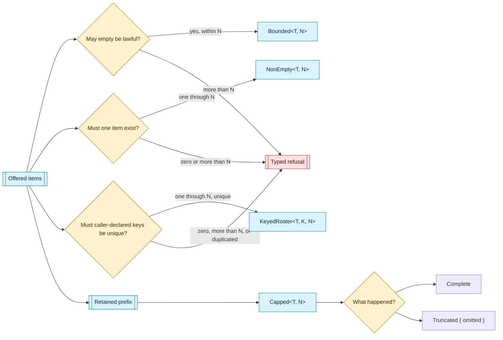

# bounded — collection shape under an owned ceiling

This home makes a collection's maximum cardinality part of its Rust type and keeps every field behind the constructors that establish its collection invariants.

The const parameter is only a ceiling.
The semantic home holding a bounded collection owns the meaning of that ceiling and names the constant supplied to it.

## Refusal and capping answer different questions

[`Bounded::new`](Bounded::new) and [`NonEmpty::new`](NonEmpty::new) admit the complete offering or return a typed refusal.

[`Overflow`] carries the ceiling and the offered count.
[`NonEmptyError`] distinguishes an absent required item from an offering wider than its ceiling.

[`Capped::first_n`](Capped::first_n) deliberately keeps the prefix that fits and records the exact omitted count as [`Capping`].
The caller never supplies that capping posture.

## Construction and reading

[`Bounded`] may begin empty and may grow only through [`Bounded::try_push`], which refuses before changing the held sequence when the next item would exceed the ceiling.
[`Bounded::from_array`] settles a fixed offering's fit at compile time.

[`NonEmpty`] stores its first item separately, so [`NonEmpty::first`] is total and no empty branch exists for a reader to write.
[`Capped`] can be constructed only from a lawful non-empty collection or by the prefix-capping road.

[`KeyedRoster`] adds one caller-declared key per member after nonempty bounded magnitude is settled.
It retains declaration order and each projected key, refuses every distinct duplicated key with its exact first and repeated positions, and supplies checked index and borrowed-key lookup without asking a later operation to restate the projection.
The caller still owns what a key means and whether any higher structural relation is lawful.

There is no unchecked `Vec` conversion, mutable iterator, or dereference escape hatch.

## Ownership boundary

This home owns cardinality shape, retained order, caller-key uniqueness, capping posture, and construction refusals.
It does not own a canonical byte encoding for arbitrary `T`.
Each semantic holder that derives identity or bytes from one of these collections owns that encoding and consumes the public ordered readers.
