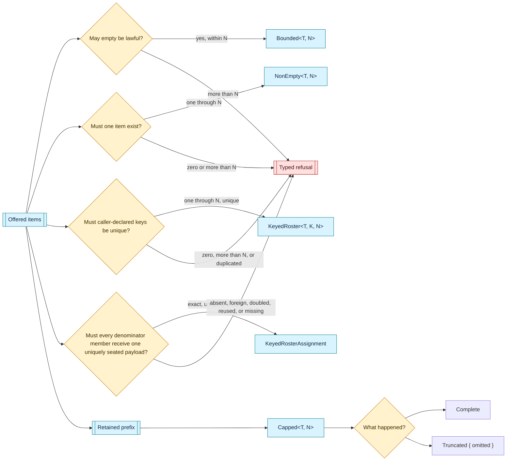

# bounded — collection shape under an owned ceiling

This home makes a collection's maximum cardinality part of its Rust type and keeps every field behind the constructors that establish its collection invariants.

The const parameter is only a ceiling.
The semantic home holding a bounded collection owns the meaning of that ceiling and names the constant supplied to it.

## Refusal and capping answer different questions

[`Bounded::new`](Bounded::new) and [`NonEmpty::new`](NonEmpty::new) admit the complete offering or return a typed refusal.

[`Overflow`] carries the ceiling and the offered count.
[`NonEmptyError`] distinguishes an absent required item from an offering wider than its ceiling.

[`Capped::first_n`](Capped::first_n) deliberately keeps the prefix that fits and records the exact omitted count as [`Capping`].
The caller never supplies that capping posture.

## Construction and reading

[`Bounded`] may begin empty and may grow only through [`Bounded::try_push`], which refuses before changing the held sequence when the next item would exceed the ceiling.
[`Bounded::from_array`] settles a fixed offering's fit at compile time.

[`NonEmpty`] stores its first item separately, so [`NonEmpty::first`] is total and no empty branch exists for a reader to write.
[`Capped`] can be constructed only from a lawful non-empty collection or by the prefix-capping road.

[`KeyedRoster`] adds one caller-declared key per member after nonempty bounded magnitude is settled.
It retains declaration order and each projected key, refuses every distinct duplicated key with its exact first and repeated positions, and supplies checked index and borrowed-key lookup without asking a later operation to restate the projection.
The caller still owns what a key means and whether any higher structural relation is lawful.

[`KeyedRosterAssignment`] takes one lawful keyed roster as its denominator and assigns exactly one offered payload to every member.
Each payload names one denominator key and one caller-declared payload-seat key.
The informed result follows denominator order and refuses foreign or doubled references, reused payload seats, and missing members without interpreting what any member or payload means.

[`KeyedRosterRows`] composes sparse reference-safe rows over one left and one right [`KeyedRoster`] without copying either roster or requiring their members to implement `Clone`.
Each row carries one generic payload, so no payload, an optional path, and an exact effect seat remain caller-owned shapes rather than different relation systems.
Admission settles row magnitude, then every foreign left reference, then every foreign right reference; a lawful value retains authored order and publishes the roster-position order used by a set-like projection.

[`KeyedRosterRows::distinct`] promotes those rows into [`KeyedRosterRelation`] only where no endpoint pair repeats.
Keeping reference safety and duplicate freedom as two informed steps lets a later caller-declared posture allow repetition, refuse it, admit emptiness, or refuse it without hiding any of those answers in this home.
Passing one roster as both operands expresses a same-roster relation, while two rosters express a cross-roster relation through the same operation.

Exact total assignment remains [`KeyedRosterAssignment`].
The sparse relation value does not duplicate its completeness, payload-seat uniqueness, or denominator-order machinery.

## Posture and structural questions

Posture values state caller choices such as authored or canonical order, open or closed membership, allowed or refused absence, and whether emptiness, repetition, self relation, cycles, partial coverage, or sparsity are permitted.
They do not change a relation value or infer which answer is lawful.

Pure question operations read an informed relation and report occupancy, repetition, left or right completeness, density, same-roster standing, self relation, reachability, and cycles.
The same informed value may be read under different caller postures, and a caller omits a question by never stating a requirement for its answer.

[`StructuralRequirement`] joins one explicit required answer to one computed answer and returns [`StructuralMismatch`] when they differ.
It returns the typed answer rather than a boolean and never combines independent questions into a score.

Reachability and cycle questions are available only where one relation proves that both endpoint sides are the same roster instance.
A foreign reachability root and two distinct roster instances refuse under separate typed causes.

Posture names are reusable structural vocabulary rather than canonical identity owned here.
The semantic holder that includes a selected posture in its meaning includes that posture's declared name in its own canonical content, while an unselected question contributes nothing.

There is no unchecked `Vec` conversion, mutable iterator, or dereference escape hatch.

## Ownership boundary

This home owns cardinality shape, retained order, caller-key uniqueness, foreign-free roster references, duplicate-free relation promotion, generic structural questions, exact denominator assignment, capping posture, and construction refusals.
It computes structural answers but never selects which answer a caller must accept.
It does not own a canonical byte encoding for arbitrary `T`.
Each semantic holder that derives identity or bytes from one of these collections owns that encoding and consumes the public ordered readers.
