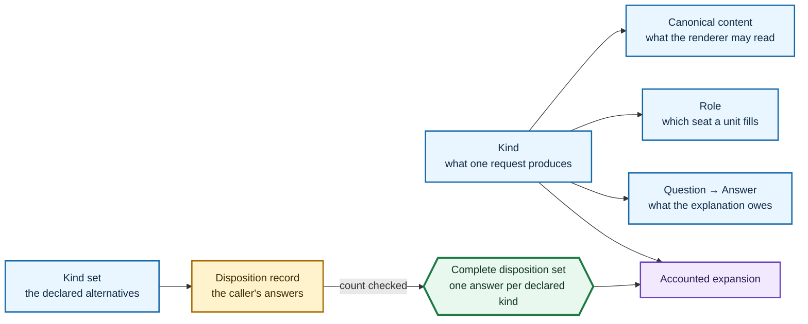

# kind

What you are generating, declared once, in your own crate.

The compiler is generic over a kind from the first step of the road to the last.
It never enumerates the kinds that exist, never registers one, and holds no list you have to get onto.

## The semantic vocabulary

A **kind** is what one request produces: a declared name, the canonically encoded content a request carries beyond its tokens, the seats its rendering fills, and the questions it owes.

**Canonical content** is the complete semantic encoding of those kind-specific facts.
The kind owns that encoding because only its declaring adapter knows which facts its renderer may read; the compiler frames the result and binds it to the exact capture and owner-qualified kind before planning.

A **role** is one seat.
A rendered unit is matched to a planned one by role, so a rendering that produced the right number of units in the wrong seats is caught by the seat rather than by a count.
`ALL` is the quantifier every walk over a rendering uses, and a role says for itself where its unit lands.

A **question** is something a kind owes an answer to beyond what every kind owes, and an **answer** is the typed value that answers one — its canonical bytes and the sentence a person reads.

`SoleRole` is the roster of a kind that renders exactly one unit at the declaration site.
`NoQuestions` is the roster of a kind that owes nothing past the universal questions; it is uninhabited, so it is also its own answer.

The executable custom-kind example lives on [`Kind`](crate::Kind), beside the exact caller contract it demonstrates.

## Where a unit lands is the role's own fact

`Destination` distinguishes declaration-site cargo, test-carrier cargo, bench-carrier cargo, and publication artifacts.
A destination is a property of the seat and not of a particular plan, so two plans of one kind cannot disagree about where their units go, and a reader asking which build compiles a unit reads the role rather than tracing the value.

## Dispositions are complete before accounting

`Disposition` is what happened to one kind that could have been generated.

Silence is not one of its answers.
Where a projection is absent the absence has a name and cites the fact that caused it, so a reader asking why one kind is missing from a set is never handed a gap.
There is no refused answer, because a request that fails any step of the road is refused whole and produces a diagnostic rather than a set.

`KindSet` names the set, its declaration-ordered names, and the consumer-owned `DispositionRecord` that surrenders its answers in the same order.
Both contracts remain open because the compiler declares no product kinds.

Naming a record is not evidence that the record is complete.
`DispositionSet::complete` compares the surrendered rows with the declared names and seals the rows behind private fields only when the counts agree.
`Accounted` accepts that informed witness rather than the consumer record, so an arbitrary implementation cannot turn silence into a complete account.

The stamp-generated record is stronger at its own construction site: it has one required field per declared kind, and adding a kind makes every record construction incomplete until the new answer is stated.
The independent count check remains at the public accounting boundary so a handwritten implementation cannot substitute an unrelated record shape for completeness.

## What is not here

There is no seal around `Kind`, `CanonicalContent`, `Role`, `Question`, `Answer`, `DispositionRecord`, or `KindSet`.
Implementing the semantic vocabulary is ordinary Rust in the declaring crate, and the compiler learns of a kind when a request carries it.

The universal questions live in `explanation/` and are never restated in a kind's roster, so a kind cannot narrow what it must explain by forgetting a row.

The compiler cannot establish that an adopter's canonical encoding is complete.
That is the declaring adapter's authority, and [`CanonicalContent`](crate::CanonicalContent) makes the required operation explicit instead of substituting `Debug`, `Hash`, or the captured bytes for a value the renderer may interpret more narrowly.

The complete disposition witness establishes only that every declared kind has one answer in declaration order.
Which row says generated about the expansion remains the consumer door's claim, because the generic compiler cannot elect what that door meant.

## The declaration stamps

`roster!` writes a closed vocabulary down: an enum, its complete roster, and one declared name per row, from one declaration.
It is for a list of names and nothing else; a role is written by hand because it also names a destination.

`kinds!` writes the related kind declarations down together: each marker and `Kind` implementation, the enumerated `KindSet`, and the `DispositionRecord` with one required field per row.
The executable stamp example and its exact generated surface live on [`kinds!`](crate::kinds).
