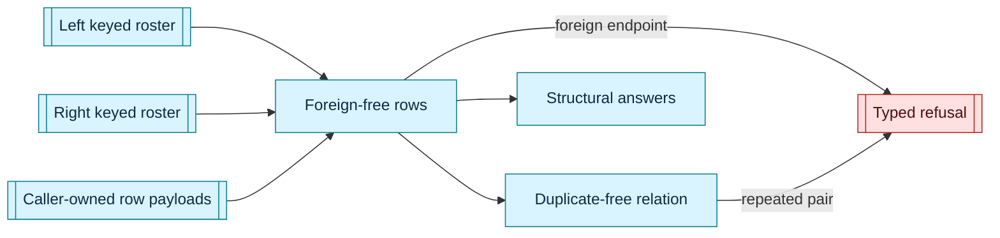

# relation — checked structure between caller-owned rosters

This home informs generic rows that reference one or two caller-owned keyed rosters and computes structural answers without choosing which answer a caller must accept.

The rosters, members, keys, row payloads, and semantic meaning remain caller-owned.
This home owns only reference safety, authored and canonical row readings, duplicate-pair promotion, and the structural questions that relations earn.

## Rows and promotion

[`KeyedRosterRows`] composes sparse reference-safe rows over one left and one right [`KeyedRoster`](crate::bounded::KeyedRoster) without copying either roster or requiring their members to implement `Clone`.
Each row carries one generic payload, so no payload, an optional path, and an exact effect seat remain caller-owned shapes rather than different relation systems.
Admission settles row magnitude, then every foreign left reference, then every foreign right reference.
A lawful value retains authored order and publishes the roster-position order used by a set-like projection.

[`KeyedRosterRows::distinct`] promotes those rows into [`KeyedRosterRelation`] only where no endpoint pair repeats.
Keeping reference safety and duplicate freedom as two informed steps lets a caller allow repetition, refuse it, admit emptiness, or refuse it without hiding any answer in this home.
Passing one roster as both operands expresses a same-roster relation, while two rosters express a cross-roster relation through the same operation.

Exact total assignment remains [`KeyedRosterAssignment`](crate::bounded::KeyedRosterAssignment) in the bounded home.
The sparse relation value does not duplicate its completeness, payload-seat uniqueness, or denominator-order machinery.

## Postures and structural questions

Posture values state caller choices such as authored or canonical order, open or closed membership, allowed or refused absence, and whether emptiness, repetition, self relation, cycles, partial coverage, or sparsity are permitted.
They do not change a relation value or infer which answer is lawful.

Pure question operations read an informed relation and report occupancy, repetition, left or right completeness, density, same-roster standing, self relation, reachability, and cycles.
The same informed value may be read under different caller postures, and a caller omits a question by never stating a requirement for its answer.

[`StructuralRequirement`] joins one explicit required answer to one computed answer and returns [`StructuralMismatch`] when they differ.
It returns the typed answer rather than a boolean and never combines independent questions into a score.

Reachability and cycle questions are available only where one relation proves that both endpoint sides are the same roster instance.
A foreign reachability root and two distinct roster instances refuse under separate typed causes.

Posture names are reusable structural vocabulary rather than canonical identity owned here.
The semantic holder that includes a selected posture in its meaning includes that posture's declared name in its own canonical content, while an unselected question contributes nothing.

## Ownership boundary

This home owns foreign-free roster references within rows, duplicate-free relation promotion, stable row readings, generic structural questions, and relation-specific refusals.
It computes structural answers but never selects which answer a caller must accept.
It owns no state-machine, policy, graph, schema, version, transition, capability, or business meaning.
It defines no universal relation syntax and no canonical byte encoding for arbitrary members or payloads.
Each semantic holder owns its grammar, selected postures, encoding, identity, projections, and effects.
