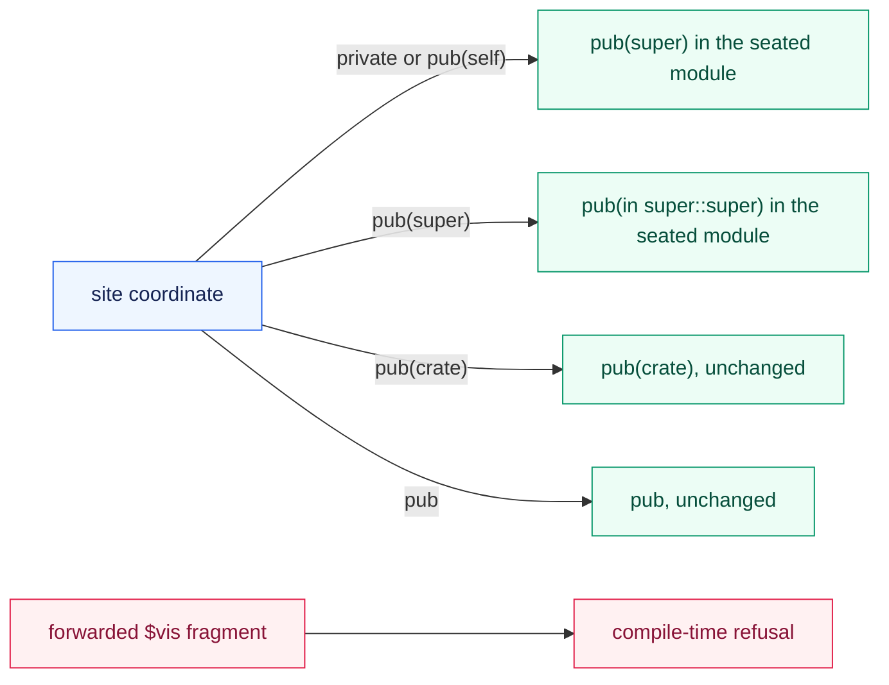

# stamp — one authored pattern, published as source

Some output cannot be written where a declaration stands.

A definition several files must reach is not expressible by tokens spliced at one declaration, and no splice can mint a name a second file then resolves.
This home renders the third road: one `macro_rules!` definition published as ordinary source somebody commits, and one invocation per site that adopts it.

## The pattern is the caller's

This home knows no pattern.

A caller declares one: the seats its material travels in, the literal syntax standing between them, and the body those seats expand into.
The body is token material the caller composed — nothing here reads it, checks what it names, or adds a line to it.

One declaration produces both halves of the grammar.
The matcher the definition is written with and the invocation each site writes are two walks over the same declared shape, so a site cannot be spelled in a form its own definition does not admit.

## The reach is transported, never copied

A pattern that seats its body inside a module of its own has a problem no caller can solve by hand.

`pub(super)` written at the site and `pub(super)` written one module deeper name two different scopes, so a reach copied straight through publishes an item somewhere nobody asked for.
Where a pattern declares a reach coordinate, the definition carries one front arm per reach: the site's own tokens land at the site's coordinate, the transported tokens land one module in, and the body writes whichever of the two it needs.

An opaque `vis` fragment cannot be transported at all — a wrapper that captured a whole visibility and forwarded it has handed over something no arm can place.
The last arm says so with the compiler's own refusal rather than guessing a scope, because a guessed reach publishes somebody's private item and nothing downstream reports it.

## What it claims

That the definition and every invocation were rendered from one declaration, and that the record states which of the two grounds makes publication lawful.

## What it does not

It stages nothing, writes no file, and commits nothing.
What it hands back is rendered trees and one record; the publication actor independently verifies and lands them.

It reads no plan of its own accord either.
A caller hands it what its plan decided, and the two refusals that reading raises are about the plan's seat and delivery, never about the pattern.

## The boundary

This home owns the authored pattern, the closed seat and site namespaces, the one-level reach transport, and the whole rendered publication value.
Planning owns whether a requested seat exists and lands as an artifact; a publication actor owns staged bytes, filesystem placement, independent comparison with the record, and version-control custody.
