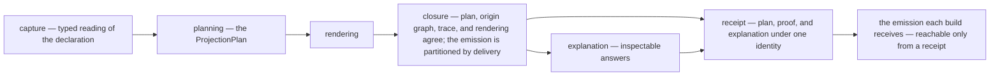
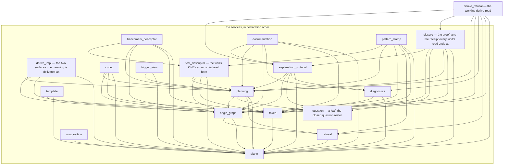

# macroc — the generation services

This is the product line: the road from a captured declaration to output that is
planned, rendered, proved closed, and explainable — an expander that writes a
record of every decision it makes. Each stage hands the next one
a value the next one cannot forge.

## The spine — the services in eight nouns

Meaning becomes planned artifacts. The arrows are honest constructors, and
the products say what a value actually requires:

```text
OwnerContentAccount              →  ProjectionIntent
ProjectionIntent (+ context)     →  Plan
Plan                             →  RenderedProjection
Plan × RenderedProjection        →  ProjectionClosure
                                    × PartitionedEmission
Plan × ProjectionClosure         →  Explanation
Plan × ProjectionClosure
     × Explanation               →  ProjectionReceipt (the only value
                                                       emission reaches)
```

The owner content account is the typed entry account — content, its
owner-supplied commitment, and its dependency set — the ONE account feeding
four readings: semantic identity, invalidation dependencies, explanation
facts, and origin edges; no second account of content dependencies ever
forms. The intent is what you meant — the kind plus the content commitment.
The plan is the decision record of one expansion: it exists inside one
service invocation, consulted by the closure and the explanation, then
bound into the receipt. The law is precise: these services own no
persistent plan store, no queue, no lifecycle, no ambient registry; an
ordinary returned plan value may remain inspectable in caller memory — the
architecture prohibits a planning institution, not ownership. The rendered
projection's members carry their own rendered-unit identities, derived from
the exact rendered bytes — a projection is not singularly identified by one
member's id. The closure proves that plan, declared membership, rendering,
origins, and trace agree — agreement among values that exist when it runs —
and then splits the rendering into the emissions its members declared: one
joined byte stream per delivery, because what the consumer's normal build
compiles, what a test target invokes, what a bench target invokes, and what a
publication writes to an address are four deliveries and not one. Every planned
member declares which one it is for, so a mutation-evaluation surface cannot
reach the normal build at all. The explanation reads the plan and the proved
closure. The receipt binds all three and is the ONLY value from which emission
is reachable — for every projection kind, and the refusal family's own receipt
type is a view over it rather than a second road around it.

## The doors

Every door is a thin shell over the one engine. Door equivalence has its
exact comparison — never plan-identity equality, which is impossible by
design since a plan's identity contains origin and distinct doors are
required to carry distinct origins: same intent identity, same declared
semantic output membership and roles, equivalent rendered semantic
contracts, origins distinct and correctly attributed; rendered bytes may
lawfully differ where a consumer binding or lawful surface spelling
differs. The builder is the engine's own entrance — the typed functions the
derive already calls — promoted to a public, documented, comfortable API:
no new station, no new folder, and if that cannot be done comfortably, the
finding is about the entrance — fix the entrance, never build a lobby. The
derive is the outside consumer's door and the worked example. A core-local
stamp cannot be a live caller — core carries no dependency edge to these
services — so a core stamp is an engine-authored published shell over the
same declaration contract, proven equivalent to the builder. The template
station is a capability, not a door, and its typed values are public:
consumers mint their own sugar — their own declaration families, their own
stamps — over this engine, and the equivalence law protects doors they
build exactly as it protects ours. Test and bench targets are consumption
sites, not doors: they invoke the declarations' generated support shells
and receive the cargo — which is a receipt's carrier emission and never its
declaration-site one, so nothing a consumption target invokes is in the normal
build; generating test rows at the product declaration site
is refused — a reverse dev dependency and a normal-build tax.



The crate's own doc comment carries the charter, the callable-without-a-proc-macro
promise, and the declaration-order law; each home's README carries that home's
narrative. This file carries the drawn module map, the mechanism this tooling
admits from outside, and the working rule it holds to when a required seat cannot
be filled.

## The module map

An arrow points at what a module imports. The same graph is stated structurally
in `src/lib.rs`: the `pub mod` list is declared in dependency order, so a module
imports only modules declared earlier than itself. Rustdoc renders no diagram
and needs none — reading that list top to bottom is reading this map, and the
`use` lines under each home are the edges themselves, greppable at their source.
A station no arrow reaches is a road not yet built, and the map shows it
without a status label.



## The publication road

Default generation writes NOTHING to disk. Publication exists only for
identifier-minting across files — git-visible source under a receipt,
committed by a human — and its admission rule is structural: publication is
lawful only when the requested output requires a cross-file artifact or
identifier minting that neither declaration-site generation nor a
core-local stamp can express, and the plan RECORDS why the lighter roads
are insufficient — the road held narrow by rule, never by a reader's mood.
The generated-support schema pair is this road's own case: both checked-in
sides written by one publication operation, under its receipt.

## The admitted digest, and what it is admitted for

The services derive their own identities — plans, closures, rendered units,
generated units, origin nodes, bundles, closed expansions — and those identities
are handed out. A receipt that names a plan is only as good as the name, so the
derivation is a **BLAKE3 identity profile**, versioned and domain-separated, over
complete transcripts.

**The dependency.** `blake3`, at the exact version the workspace dependency table
decides once for every member that names it, with `default-features = false`.
That table carries the pin; this home carries why the services reach for the
mechanism at all, and why the cut is the one it is. The default `std` feature
buys an `io::Write` adapter and error-trait impls the services name nowhere.
`rayon` is not a default feature and is never named: an expansion running inside
`rustc` must not stand up a thread pool to hash a few kilobytes. `serde`,
`zeroize`, `mmap`, and the digest-trait previews buy surfaces the plane has no
seat for. What is left is `Hasher` and `derive_key`, which is the whole mechanism
the profile uses. The crate carries its own build script and C/assembly fast
paths on the platforms that have them; that is a property of the admitted
dependency and is disclosed here rather than discovered by whoever first builds
without a C toolchain.

**And unusually, that cut is settled and not merely requested.** A manifest asks;
a resolved graph holds; a compiled unit is handed. `deny.toml` settles the middle
one, and for `blake3` it settles it as EMPTY and exact — no crate anywhere in
this graph turns a `blake3` feature on. An empty graph set is the one case that
reaches the third fact too, because a unit's features are a subset of what the
graph resolved.

**This admission is the TOOLING PLANE's, and it is not band 07's.** Band 07's
digest-family rule proposes blake3-256 for the machine's commitments, under the
machine's domain-tag register, and admitting it is a separate mechanism decision
with a separate owner. The two admissions share an algorithm and nothing else:
different preimages, different domain separation, different claims, different
owners. Neither one licenses the other, and a plane identity is never accepted
where a machine commitment is required.

**What the profile claims.** An identity is derived over its subject's complete
transcript, never over a reduced fold. The claim's full statement — the
collision resistance inherited, what each mint site still owes, and what the
profile never claims — is owned by `ProjectionIdentity` and
`ProjectionTranscript` in `src/plane/types.rs`.

## The failed required seat

**A required seat is never repaired with an empty, default, or neighbouring
value after construction fails — a failed required seat is a typed refusal.**

This is a rule about what the services do at the moment something impossible
happens. A checked seam returns a `Result`; a caller that has no honest value for
the failing case reaches for the nearest one it can see, and the nearest one is
always wrong in the same three ways:

- **empty** — a rendering that did not fit becomes a blank explanation;
- **default** — an owner fact nobody cited stands in for the one the plan
  declares;
- **neighbouring** — the first member of a set stands in for the member under a
  role, the first rendered unit's digest stands in for the digest of the unit
  this seat is about.

Each of those produces a value that is well-formed, complete-looking, and about
something else. That is strictly worse than a refusal, because everything
downstream then proves the wrong claim correctly: a membership shortened to one
member is closed over, at one member, and the closure is honest about a plan that
is not.

The rule has two halves, and the first is the one that does the work.

**Where the failing case cannot happen, the road must not have it.** A complete
set fixed by a shape, a static rendering whose length is a compile-time fact, a
roster with a known arity — none of these has a runtime count to read, so none of
them returns a `Result`. `PlannedMembership::complete`,
`RenderedProjection::complete`, `NonEmptyBounded::from_array`, and the seam behind
`human_projection!` are *total structural* constructors: the bound is settled by
const evaluation and there is no error branch for a caller to fill. This is the
half that removes the temptation rather than policing it.

**Where the failing case can happen, the refusal is typed and it propagates.** It
names the seat (`ExplanationBindingRefusal::RequiredOutputAbsent`), the role
(`ClosureIssue::MemberPlannedTwice`), the axis and magnitude
(`ProjectionPlanningIssue::BoundExceeded`), or the bound it overran
(`CaptureBound`). It reaches a caller as a diagnostic that keeps those
distinctions — one related identity per established issue, the first issue's own
classification, and a summary composed from the typed values.

Saturating a numeric conversion to `MAX` while REPORTING a count is not this
defect and is not touched by the rule: it is a rendering of a number too large to
render, inside a refusal that has already been established.

## What the services never do

They own no semantic noun. The body shapes are band 00's; the canonical cause key
grammar is band 00's; the selection order's content is the author's. A tooling
type may summarize, reference, plan, explain, or project an owner fact; it may
never create a second value that independently answers the owner's semantic
question — which is why an unanchored diagnostic says it is unanchored rather
than carrying a minted stand-in.
