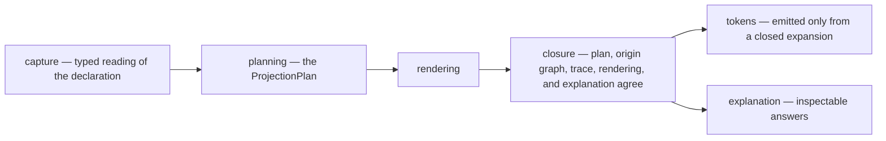

# macroc — the metaprogramming services

The services are ordinary callable Rust — capture, planning, rendering, closure,
inspection, explanation — reached the same way by any caller. They depend inward
on the machine and never back outward: nothing here knows a proc-macro exists.

The crate's own doc comment carries the charter and the dependency order; this
file carries what a README owes that rustdoc does not: **the mechanisms this
tooling admits, and the qualification obligations it stands under.**

## The admitted digest, and what it is admitted for

The services derive their own identities — plans, closures, rendered units,
generated units, origin nodes, bundles, closed expansions — and those identities
are handed out. A receipt that names a plan is only as good as the name, so the
derivation is a **BLAKE3 identity profile**, versioned and domain-separated, over
complete transcripts.

**The dependency.** `blake3`, at the exact version the workspace dependency table
decides once for every member that names it, with `default-features = false`.
That table carries the pin; this home carries why the services reach for the
mechanism at all, and why the cut is the one it is. The default `std` feature
buys an `io::Write` adapter and error-trait impls the services name nowhere.
`rayon` is not a default feature and is never named: an expansion running inside
`rustc` must not stand up a thread pool to hash a few kilobytes. `serde`,
`zeroize`, `mmap`, and the digest-trait previews buy surfaces the plane has no
seat for. What is left is `Hasher` and `derive_key`, which is the whole mechanism
the profile uses. The crate carries its own build script and C/assembly fast
paths on the platforms that have them; that is a property of the admitted
dependency and is disclosed here rather than discovered by whoever first builds
without a C toolchain.

**And unusually, that cut is settled and not merely requested.** A manifest asks;
a resolved graph holds; a compiled unit is handed. `deny.toml` settles the middle
one, and for `blake3` it settles it as EMPTY and exact — MEASURED, no crate
anywhere in this graph turns a `blake3` feature on. An empty graph set is the one
case that reaches the third fact too, because a unit's features are a subset of
what the graph resolved. So this paragraph is not a claim about what the services
compile with; it is the reason behind a rule that already proves it.

**This admission is the TOOLING PLANE's, and it is not band 07's.** Band 07's
digest-family rule proposes blake3-256 for the machine's commitments, under the
machine's domain-tag register, and admitting it is a separate mechanism decision
with a separate owner. The two admissions share an algorithm and nothing else:
different preimages, different domain separation, different claims, different
owners. Neither one licenses the other, and a plane identity is never accepted
where a machine commitment is required.

**What the profile claims.** For a transcript as specified beside
`ProjectionTranscript`, under the declared profile version, collision resistance
is claimed AS BLAKE3's — finding two transcripts that derive one identity is as
hard as finding a BLAKE3 collision.

**What it does NOT claim.** It does not claim that two things the plane considers
different always have different transcripts; that is each mint site's
completeness, documented at each mint site. It does not claim anything across
profile versions, which derive under different contexts and are different name
spaces. It does not make a plane identity into a machine commitment. And it makes
no claim at all about keyed use, authentication, or protection: the profile uses
`derive_key` for domain separation and holds no secret.

**What it replaced.** An in-house four-lane FNV-shaped fold that explicitly
claimed no collision resistance at any width, and that reduced both the anchor
and the content to eight bytes before hashing. That scheme is retired outright —
deleted, not re-hashed. Hashing a lost-information fold with a strong digest
would have produced a strong-looking value carrying a weak preimage, which is a
worse position than the honest nonclaim it started from.

## The working rule: a failed required seat is a typed refusal

**A required seat is never repaired with an empty, default, or neighbouring
value after construction fails — a failed required seat is a typed refusal.**

This is a rule about what the services do at the moment something impossible
happens. A checked seam returns a `Result`; a caller that has no honest value for
the failing case reaches for the nearest one it can see, and the nearest one is
always wrong in the same three ways:

- **empty** — a rendering that did not fit becomes a blank explanation;
- **default** — an owner fact nobody cited stands in for the one the plan
  declares;
- **neighbouring** — the first member of a set stands in for the member under a
  role, the first rendered unit's digest stands in for the digest of the unit
  this seat is about.

Each of those produces a value that is well-formed, complete-looking, and about
something else. That is strictly worse than a refusal, because everything
downstream then proves the wrong claim correctly: a membership shortened to one
member is closed over, at one member, and the closure is honest about a plan that
is not.

The rule has two halves, and the first is the one that does the work.

**Where the failing case cannot happen, the road must not have it.** A complete
set fixed by a shape, a static rendering whose length is a compile-time fact, a
roster with a known arity — none of these has a runtime count to read, so none of
them returns a `Result`. `PlannedMembership::complete`,
`RenderedProjection::complete`, `NonEmptyBounded::from_array`, and the seam behind
`human_projection!` are *total structural* constructors: the bound is settled by
const evaluation and there is no error branch for a caller to fill. This is the
half that removes the temptation rather than policing it.

**Where the failing case can happen, the refusal is typed and it propagates.** It
names the seat (`ExplanationBindingRefusal::RequiredOutputAbsent`), the role
(`ClosureIssue::MemberPlannedTwice`), the axis and magnitude
(`ProjectionPlanningIssue::BoundExceeded`), or the bound it overran
(`CaptureBound`). It reaches a caller as a diagnostic that keeps those
distinctions — one related identity per established issue, the first issue's own
classification, and a summary composed from the typed values.

Saturating a numeric conversion to `MAX` while REPORTING a count is not this
defect and is not touched by the rule: it is a rendering of a number too large to
render, inside a refusal that has already been established.

## What the services never do

They decide no meaning. The three body shapes are band 00's; the canonical cause
key grammar is band 00's; the selection order's content is the author's. A
tooling type may summarize, reference, plan, explain, or project an owner fact;
it may never create a second value that independently answers the owner's
semantic question — which is why an unanchored diagnostic says it is unanchored
rather than carrying a minted stand-in.
