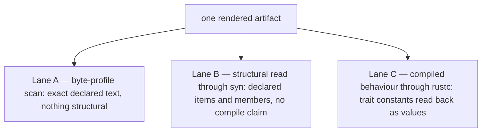

# testpak — the qualification plane

testpak is the judge: hostile executable evidence against the machine and the
generation services. What the plane is, how its seats are mapped, and what a
verdict may claim are stated in `src/lib.rs`. This file carries what has no
other home — the dependency direction, the reserved-name ladder, the reason
this package asks for the third-party mechanisms it asks for, and a map of
where every other statement lives.

## The dependency direction

testpak depends inward — on `threadpak`, on `threadpak-macroc`, and on
`threadpak-macros` — and **nothing depends on testpak**. Production never
depends on its judge. The workspace manifests are where that is visible:
testpak is a member, and no crate's dependency table names it.

It is never published: dev-and-qualification material, first-class, and never
on the production dependency path.

## The reserved names

**A reserved name fixes the intended question of a seat. It does not claim that
the seat exists, has an owner implementation, or has satisfied admission** —
name reserved ≠ home materialized ≠ implementation admitted ≠ qualification
established. Content that does not fit its reserved name comes back for an
explicit decision instead of being normalized into the nearest drawer.

Each reserved seat's own README states its question, its filling condition, and
what the reservation does not claim. Those READMEs are the occupancy record;
nothing here keeps a second one.

## The three lanes

The doctrine — what each lane may claim, why no lane subsumes another, and why
the readers stay dumb — is `src/03_judge/mod.rs`.

Outside-consumer parity is a seat with no crate. No package in this workspace
applies the expansion shell's derive to a lawful declaration, compares what
comes back against hand-written twins, or reaches the machine under a renamed
dependency binding — so no lane here claims any of that.

## The third-party mechanisms this package asks for

Which version and which feature cut is the workspace's one decision, in the
root manifest's `[workspace.dependencies]` table. What this package owes is the
reason it reaches for each mechanism, beside the reading that mechanism buys.

**`syn`, for lane B.** Lane A finds bytes. Whether the artifact DECLARES an
implementation, what that implementation targets, whether the anchored constant
is a member of it, and whether a comment put those bytes there are not
questions about bytes, and no number of anchors turns them into ones. Making
the scan answer them means writing a Rust parser inside the judge, from the
same understanding the renderer was written from — and two readings of one
understanding agree because they share it. So the text goes to a decoder that
owes this repository nothing. Two features carry the reading: `parsing`,
without which there is no text-to-tree road at all, and `full`, without which
items and their associated constants are not in the tree. The lane asks for
nothing beyond those two, because it reads, never writes, and never runs inside
a macro.

**And that reason settles less than it sounds like.** What a manifest ASKS FOR,
what the resolved graph HOLDS, and what one compiled unit is HANDED are three
different facts. The paragraph above states the first. `deny.toml` settles the
second against the graph itself, and the set it settles there is wider than the
two named above, because the compile-refusal harness brings in a crate that
asks for more. The third has no seat anywhere in this tree, so no sentence here
says the unit lane B links carries those two features and nothing else.

**`blake3`, for the independent transcript lane.** That lane re-derives a
published identity from its published specification, writing out every encoding
decision itself and importing none. The digest is the one thing it shares with
the producer, deliberately: a lane that reimplemented the hash would be judging
an arithmetic exercise, and the hash is not what is under judgement — whether
the specification says enough for somebody else to re-derive the value is.

## Where each statement lives

| Statement | Home |
| --- | --- |
| The plane, its seats, and what a verdict may claim | `src/lib.rs` |
| The lane doctrine | `src/03_judge/mod.rs` |
| Everything a judge can say, and why `Unreadable` is a failure class | `src/03_judge/types.rs` |
| Lane A's anchors and the exact edge of its claim | `src/03_judge/byte_profile.rs` |
| Lane B's reading, and what it refuses to claim | `src/03_judge/structural.rs` |
| The damage a judge inflicts on a lawful artifact | `src/03_judge/mutation.rs` |
| Which lane owns catching each mutation | `src/03_judge/type_contract.rs` |
| A reserved seat's question, filling condition, and nonclaims | that seat's own README |

Every file under `tests/` states its own subject in its header: lanes A and B
are held to exactly their recorded rows in `tests/planted_defect.rs`, lane C's
compiled seats are `tests/compiled_behaviour.rs`, and the independent
transcript lane is `tests/independent_identity_transcript.rs`.
