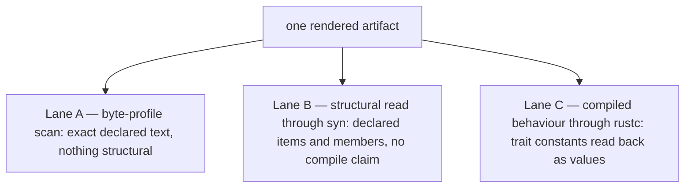

# testpak — the qualification plane

testpak orchestrates hostile execution against the machine and its tooling, and
carries the denominators every verdict is stated over. **A verdict here is
always claim-specific and method-specific**: "the permuted rendering was
rejected by the string scan over these two declared orders" is a verdict; "the
derive works" is not one.

The dependency direction is the whole point. testpak depends inward — on
`threadpak`, on `threadpak-macroc`, and on `threadpak-macros` — and **nothing
depends on testpak**. Production never depends on its judge.

It is a workspace member and never published: it is dev-and-qualification
material, first-class, and never on the production dependency path.

## Seat coordinates

The plane is a numbered waterfall of seats, mapped by `#[path]` exactly as the
machine maps its bands: the number is visible in the tree and never in a module
name. **A seat exists only once it holds something.** The module declarations in
`src/lib.rs` are the source-home population; a reserved coordinate's own README
states that it is empty. Any assembled summary must derive from those owners
rather than maintain another occupancy roster here.

**A reserved name fixes the intended question of a seat. It does not claim that
the seat exists, has an owner implementation, or has satisfied admission** —
name reserved ≠ home materialized ≠ implementation admitted ≠ qualification
established. Content that does not fit its reserved name comes back for an
explicit decision instead of being normalized into the nearest drawer.

Each reserved seat is a directory carrying exactly one file: a README stating the
seat's question, that its state is reserved, that it currently contains nothing,
the exact condition that would fill it, and what the reservation explicitly does
not claim. That is a coordinate carrying its own honest specification, and it is
the opposite of an empty directory dressed up to look occupied. **No `mod.rs`, no
type, no API, and no obligation row stands for a reserved seat** — `lib.rs`
declares no module at those coordinates, so nothing in this package can reach
one.

## `Unreadable` is a failure class with its own alarm

`RenderVerdict::Unreadable` is not noise, not a skip, and not a softer
`Deviates`. It means one specific thing: **the judge could not find the
construct it anchors on.** Either the artifact stopped stating that construct,
or the artifact still states it and the anchor no longer matches the text.
Both are real findings.

So a test asserting that a lawful rendering conforms must FAIL on `Unreadable`,
and must never be written to accept it alongside `Conforms`. A silent
`Unreadable` is worse than a deviation: a deviation says the renderer is wrong,
while an ignored `Unreadable` says nothing at all while every assertion
downstream of it quietly stops testing anything.

**The response to a false alarm is to fix the anchor deliberately, never to
loosen the reader.** When a rendering legitimately changes shape, the anchor
constant in `src/03_judge/byte_profile.rs` is re-stated to match the new shape,
in one place, on purpose, visible in the diff. Widening the reader until it
matches again — trimming whitespace, matching a prefix, adding a looser fallback
— buys a green run by making the judge cleverer, and a clever judge has stopped
reading the artifact and started agreeing with the renderer.

The alarm is rehearsed rather than trusted:
`a_whitespace_shifted_lawful_rendering_is_unreadable` takes a genuinely lawful
rendering, shifts blank space inside the anchored const item, and requires
`Unreadable` — with the unshifted text asserted to conform first, so the
rehearsal cannot pass over a rendering that was simply wrong.

## The planted defect

Every macro family in this repository ships with a deliberately defective
expansion that testpak must reject. The refusal-family derive's is
`PlantedDefect`, reached through a documented qualification seam on the
derivation: it changes the RENDERING and leaves the captured declaration alone,
so the defect is a disagreement between the text and the declaration it claims
to project — detectable, and detectable only from outside.

Activation is observed, not assumed. The test asserts both directions: the
defective rendering IS rejected, and the lawful rendering passes. A checker that
rejected everything would satisfy the first half and fail the second.

The judge does not ask the services what the declared order was. It states the
order itself, beside the declaration it wrote, so the comparison is between two
independent statements rather than between a value and itself.

## The three lanes, and what each one may claim

**Lane A — the byte-profile scan** (`src/03_judge/byte_profile.rs`). Its claim
is exactly *the rendered text contains this exact declared textual form* and
never anything structural. It reads text `rustc` never touched, which is exactly
its value: it catches a renderer emitting the wrong bytes before those bytes are
ever offered to a compiler, and it costs a string search.

**Lane B — the structural read** (`src/03_judge/structural.rs`). Its claim is
exactly *the artifact DECLARES these implementations, of these traits, for this
target, written this way, carrying these members and no others* — what item is
this, what does it target, which contract does it realize, is it written
`unsafe`, negative, `default`, or generic, does it exist at all under some `cfg`,
are the cause rows the declared ones and are they built through the declared
constructors, did a member nobody planned come along, was one stated twice, did
an item nobody planned come along, was one emitted twice. It answers those by
parsing the text with a parser nobody here wrote, and it claims nothing about
whether any of it compiles.

**Lane C — compiled behaviour** (`tests/compiled_behaviour.rs`). `rustc`
compiles the artifact and the tests read its trait constants as VALUES. The
LAWFUL artifact's seat is the consumer fixtures, and it has to be: they compare
the derived implementation against hand-written twins from outside both
participants, and the renamed-consumer fixture reaches the machine only under
`tp`, so a renderer hardcoding the default binding would fail to compile there.
The MUTANTS' seats are this package's, because a mutant is this plane's own
damage and no participant is grading itself when the judge hands its own damaged
text to a compiler.

**Why the dumb reader stays dumb.** A cleverer reader has to decide what the text
MEANS, and the only way to decide that is to implement the same understanding the
renderer already has. Two implementations of one understanding, written by the
same hands against the same document, agree because they SHARE THE CHALLENGED
IMPLEMENTATION — not because either of them understands Rust. Correlated evidence
about a renderer is not independent of that renderer. Lanes B and C escape this
because their decoders — `syn` and `rustc` — are decoders nobody here wrote.

## The independent transcript lane

The services derive every plane identity from a transcript whose specification
they publish. A specification is a promise that somebody else can re-derive the
value; `tests/independent_identity_transcript.rs` is that somebody else.

**What it shares with the producer: nothing that encodes.** The length framing,
the field order, the domain-string grammar, the subject names, the role names,
the role slots, the anchoring discriminants, the profile stem, the profile
version, the generator name, and the generator schema version are all written out
in full in the test, from the specification, exactly as the planted-defect lane
writes out the declared order it judges against. Not one encoding function or
spelling is imported from `threadpak-macroc`.

**What it does share, deliberately: the digest.** Both sides call BLAKE3, pinned
exact at the same version with the same minimal feature set. A lane that
reimplemented the hash would be judging an arithmetic exercise; the hash is not
what is under judgement. What is under judgement is whether the specification says
enough — which is the question a reader of a published receipt actually has.

**What it derives.** A real captured-declaration identity, over a declaration the
services actually read, plus rooted and anchored transcripts across three
subjects. **And it rehearses its own reversal twice**: an encoder that drops the
content's length prefix must disagree, and a context assembled with the subject
and the role transposed must disagree. A match that could not fail would be
evidence of nothing.

## The structural lane's admitted dependency

**Why the string lane cannot answer this claim.** Lane A finds bytes. Told that
`const SELECTION_ORDER : … = &["A", "B"]` is present, it has established that
those bytes are somewhere in the text — not that the artifact declares an
implementation, not that the implementation targets the right type, not that the
constant is a MEMBER of that implementation, not that a second implementation
nobody planned is sitting beside it, and not that a comment put the bytes there.
Making the scan answer any of that means teaching it what an item, a path, a
member, and a comment are — which is writing a Rust parser, by hand, inside the
judge, from the same understanding the renderer was written from. Two readings of
one understanding agree because they share it. So the claim is not reachable by
making lane A cleverer; it is reachable only by handing the text to a decoder
that owes this repository nothing.

**The dependency.** `syn`. The exact version and the feature cut are decided once
in the workspace dependency table and inherited here; what this home owes is the
reason, not a second copy of the decision. Two features carry the reading:
`parsing`, without which there is no text-to-tree road at all, and `full`,
without which items and their associated constants are not in the tree. The lane
asks for nothing beyond those two, because it reads and never writes and never
runs inside a macro.

**And that reason settles less than it sounds like.** What a manifest ASKS FOR,
what the resolved graph HOLDS, and what one compiled unit is HANDED are three
different facts. This paragraph states the first. `deny.toml` settles the second
against the graph itself, and the set it settles there is wider than the two
named above, because the compile-refusal harness brings in a crate that asks for
more. The third has no seat anywhere in this tree, so no sentence here says the
unit this lane links carries those two and nothing else — the lane's claim is
about what it reads Rust with, never about what its unit was compiled with.

**What it reads out of the tree.** Per item: whether the item is a trait
implementation at all, the trait path (segments and leading `::`), the target
type path, and each associated constant by name — `SHAPE`'s variant word,
`SELECTION_ORDER`'s string list in order, and `DECLARED_ORDER`'s cause rows as
the rows they are — the four constructor paths each row is built through, the two
seats of the stable identity it mints, and the spelling it states, in order. Across
items: how many were declared, whether one trait-and-target pair was implemented
twice, and whether anything that is not a declared trait implementation came
along.

**What it shares with the producer: nothing.** Not the capture, not the plan, not
the renderer, not `GeneratedTree` or any token type the renderer writes, not the
projection that turns that tree into text, and no constant, anchor, or spelling
imported from `threadpak-macroc`. The declaration it compares against is written
out in full in `tests/planted_defect.rs`, beside the declaration handed to the
services and independent of it. The parse is `syn`'s, by Rust's rules.

**What it does NOT claim.** Nothing about compilation. Not that the artifact
typechecks, not that its paths resolve, not that the trait it names exists, not
that the target type exists, not that the implementation is coherent, and not
that any constant evaluates to the value its spelling suggests.
`::threadpak::refusal::SomethingElse` reads here as *a different path than the
one declared* and never as *no such contract*. All of that is lane C's, where
`rustc` compiles the artifact and the constants come back as values. And
`Unparsable` is a failure class of its own, exactly as lane A's `Unreadable` is:
never a skip, never a softer `Deviates`.

**The planted mutations it must catch**, all nine recorded as structural in
`src/03_judge/type_contract.rs`, each landing on a different structural fact:

| Mutation | What lane B reports |
| --- | --- |
| `ImplTargetAltered` | the implementation targets a type the declaration did not name |
| `TraitPathWrong` | the implementation realizes a trait path the declaration did not name |
| `UnplannedOutputAdded` | the artifact declares more implementations than the declaration names |
| `DecoyInComment` | the selection order the artifact DECLARES is not the declared roster — the comment carrying the anchored bytes is not in the tree at all |
| `ImplMemberDuplicated` | one expected constant is stated twice, and the second reading is recorded rather than written over the first |
| `ImplMemberUnexpected` | the implementation carries a member the declaration did not name, described by what it is |
| `ConstructorPathAltered` | a cause row carries the declared values through one of the four constructors the declaration did not name |
| `ImplPostureAltered` | the implementation is written `unsafe`, where the declaration names none of the four postures |
| `MeaningBearingAttributeAdded` | the implementation carries an attribute that decides something — a doc comment decides nothing and is not one |

The decoy is the pair that makes the split visible in one line: lane A reports
`Conforms` on it and lane B reports the reversed order, and both are right, in
their own methods, about different questions.

## Mutation is the judge's job

The services no longer carry a road that renders a deliberately defective
artifact. A generator writing its own exam is rehearsed only against the defects
it already imagined. `src/03_judge/types.rs` declares fifteen mutations,
`src/03_judge/mutation.rs` damages lawful artifacts itself, and
`src/03_judge/type_contract.rs` records per mutation WHICH LANE owns catching
it — three files because a roster, a cut, and a ledger are three different
statements. Ownership is the seat of the CLAIM rather than a boast of
exclusivity: lane B notices a permuted order too and says nothing about it,
because that verdict is stated over lane A's method and belongs to lane A's row.

Every recorded ownership now has evidence under it. Lane A and lane B are held to
exactly their own rows in `tests/planted_defect.rs`; lane C's two rows are held
in `tests/compiled_behaviour.rs`, and the test that enumerates them fails if a
third mutation is ever recorded as compiled behaviour without a compiled seat.
